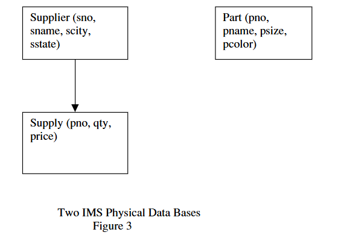

# [What Goes Around Comes Around](https://15721.courses.cs.cmu.edu/spring2020/papers/01-intro/whatgoesaround-stonebraker.pdf)（因果循环）

# Abstract

本文总结了35年来数据模型提案的历史，分为9个不同的时代。我们讨论了每个时代的提案，并指出只有少数基本的数据建模思想（即新的思想其实很少），而且大多数已经存在了很长时间。后来的提案不可避免地与某些早期的提案非常相似。因此，研究以前的提案是一项值得的工作。

此外，我们还介绍了从每个时代的提案探索中学到的教训。大多数当前的研究人员在许多以前的时代并不存在，对以前学到的东西了解有限（如果有的话）。有句古老的格言说，不了解历史的人注定要重蹈覆辙。通过呈现“古老的历史”，我们希望未来的研究人员能够避免重演历史。

不幸的是，当前XML时代的主要提案与1970年代早期的CODASYL提案非常相似，后者因其复杂性而失败。因此，当前的时代正在重演历史，“三十年河东，三十年河西”。希望下一个时代会更聪明。

# 1.Introduction

数据模型提案自1960年代末以来一直存在，当时第一作者“登场”。在随后的35年里，提案以惊人的规律性持续出现。此外，当前许多提案来自太年轻的研究人员，他们没有从早期讨论中学习到经验。因此，本文的目的是总结35年来的“进步”，并指出从这个漫长的过程中应该学到什么。

我们将数据模型提案分为九个历史时代：

- 层次模型（IMS）：1960年代末和1970年代
- 网络模型（CODASYL）：1970年代
- 关系模型（Relational）：1970年代和1980年代初
- 实体-关系模型（E-R）：1970年代
- 扩展关系模型（Extended Relational:）：1980年代
- 语义模型（semantic）：1970年代末和1980年代
- 面向对象模型（object-oriented）：1980年代末和1990年代初
- 对象-关系模型（object-relational）：1980年代末和1990年代初
- 半结构化模型-semi-structured（XML）：1990年代末至今

在每一阶段，我们将以中立符号讨论数据模型及相关查询语言，避免陷入各提案的独特细节。同时，我们使用统一术语以减少混淆。

全文以Codd（1970）的“供应商与零件”标准示例为基础，其关系模式如图1所示：


在这里，我们有供应商信息、零件信息和供应关系，以指示供应商可以供应零件的条件。

# 2.IMS时代-层次数据模型

IMS模型于1968年左右发布，最初采用**层次数据模型**。它引入了**记录类型**的概念，即一组命名字段及其关联的数据类型。每个记录类型的实例必须符合该记录类型定义中描述的数据结构。此外，记录类型的某些字段子集必须能够唯一标识一个记录实例，即这些字段必须构成一个键。最后，记录类型必须组织成树形结构，使得每个记录类型（除根节点外）都有一个唯一的父记录类型。一个IMS数据库是记录类型实例的集合，其中每个实例（除根实例外）都有一个正确记录类型的单一父节点。


这种树形数据结构的要求对我们的示例数据提出了挑战，因为我们被迫以图2所示的两种方式之一来组织数据。这两种表示方式具有两个共同的缺点：

1. **信息重复**：在第一种模式中，零件的信息会为每个供应该零件的供应商重复存储。在第二种模式中，供应商的信息会为每个供应的零件重复存储。信息重复是不可取的，因为它可能导致数据不一致。例如，一个重复的数据元素可能在部分地方被修改，而在其他地方未被修改，从而导致数据库不一致。
2. **存在依赖父节点**：在第一种模式中，不可能存在一个当前未被任何供应商供应的零件。在第二种模式中，不可能存在一个当前未供应任何零件的供应商。在严格的层次结构中，这些“边界情况”无法得到支持。

IMS选择层次数据库是因为它便于实现一种简单的数据操作语言——DL/1。IMS数据库中的每个记录都有一个**层次序列键（HSK）**。HSK是通过将祖先记录的键连接起来，然后加上当前记录的键生成的。HSK定义了IMS数据库中所有记录的自然顺序，基本上是深度优先、从左到右的顺序。DL/1语言紧密依赖于HSK顺序来实现命令的语义。例如，“get next”命令返回HSK顺序中的下一个记录。另一个使用HSK顺序的命令是“get next within parent”，它会在给定记录的子树中按HSK顺序遍历记录。

使用第一种模式，可以通过以下方式找到供应商16供应的所有红色零件：

```p
Get unique Supplier (sno = 16)  
Until failure do  
    Get next within parent (color = red)  
Enddo  
```

第一条命令找到供应商16，然后在该记录的子树中按HSK顺序遍历，查找颜色为红色的零件。当子树遍历完毕时，返回一个错误。

需要注意的是，DL/1是一种**逐记录操作**的语言，程序员需要构建算法来解决查询问题，然后IMS执行该算法。通常，查询有多种解决方法。以下是上述查询的另一种实现方式：

```
Until failure do  
    Get next Part (color = red)  
Enddo  
```

尽管人们可能认为第二种方法明显不如第一种方法高效，但实际上，如果数据库中只有一个供应商（编号为16），第二种方法的性能会优于第一种。DL/1程序员必须在这种优化权衡中做出选择。

IMS 支持四种不同的层次化数据存储格式。基本上，根记录（root records）可以采用以下方式存储：

- 按顺序存储（Stored sequentially）
- 使用记录键（key）在 B-tree 索引中存储（Indexed in a B-tree using the key of the record）
- 使用记录键进行哈希存储（Hashed using the key of the record）

从根记录查找从属记录（Dependent records）的方法包括：

- 物理顺序查找（Physical sequentially）
- 使用各种类型的指针（Various forms of pointers）

某些存储组织方式对 DL/1 命令施加了限制。例如，纯顺序组织（purely sequential organization）不支持记录插入（record inserts）。因此，它仅适用于批处理环境（batch processing environments），其中变更列表（change list）按照 HSK 顺序排序（HSK order），然后对数据库进行单次遍历（single pass），在正确的位置插入变更，最终写入一个新的数据库。这种处理方式通常被称为“旧主文件-新主文件”（old-master-new-master）处理模式。此外，基于键进行哈希存储的组织方式无法支持“get next”操作，因为它无法轻松地按 HSK 顺序返回哈希记录。

IMS 这些存储方式的“特殊性”（quirks）旨在避免某些操作导致极端糟糕的性能。然而，这种决策也带来了代价：用户无法自由地更改 IMS 的存储组织来优化数据库应用程序，因为无法保证 DL/1 程序仍能继续运行。

数据库应用程序能够继续运行，而不受物理层面调整的影响，这种能力被称为**物理数据独立性（Physical Data Independence）**。物理数据独立性至关重要，因为 DBMS 应用程序通常不会一次性编写完成。随着新程序不断加入应用系统，数据库的调优需求可能会发生变化，通过调整存储组织可以提升 DBMS 的性能。

然而，IMS 选择了**限制**物理数据独立性的程度，这意味着开发者在优化存储组织时，可能会遇到一定的约束。

此外，应用的**逻辑需求**也可能随时间而变化。例如，由于新的业务需求或政府法规要求，可能需要添加新的记录类型，或者将某些数据元素从一个记录类型移动到另一个记录类型。IMS **支持一定程度的逻辑数据独立性（Logical Data Independence）**，因为 DL/1 实际上是基于**逻辑数据库（Logical Database**）而非实际存储的**物理数据库（Physical Database）**来定义的。因此，在编写 DL/1 程序时，逻辑数据库可以被定义为与物理数据库完全一致。而在后续阶段，可以在物理数据库中添加新的记录类型，并通过重新定义逻辑数据库来排除这些新记录类型。

因此，IMS 数据库可以随着新记录类型的加入而扩展，而最初编写的 DL/1 程序仍然能够正确运行。总体而言，IMS 逻辑数据库可以看作是物理数据库的**子树（subtree）**。

让程序员与数据的**逻辑抽象层**进行交互是一种优秀的设计理念，因为这样可以在调整物理存储组织时，**不影响** DL/1 程序的运行。逻辑和物理数据独立性至关重要，因为 DBMS 应用程序的生命周期通常远长于其操作的数据，往往可持续**数十年（通常超过 25 年）**。数据独立性使得数据结构的变更不会导致昂贵的程序维护成本。

关于 IMS，还有最后一点值得说明。正如前文所述，我们的示例数据并不适用于**树状结构（Tree-Structured Representation）**。因此，IMS 早期就面临压力，需要以不产生冗余或依赖关系的方式来表示这些数据。对此，IMS **扩展了逻辑数据库的概念**，使其超越了最初的定义，以更灵活的方式支持不同的数据组织需求。



假设构建了两个物理数据库：一个仅包含**零件（Part）**信息，另一个包含供应商（Supplier）和供应（Supply）信息，如图 3 所示。由于 DL/1 程序是基于**树结构（Tree Structure）**定义的，因此它们无法直接作用于图 3 所示的结构。

为了解决这一问题，IMS **允许定义逻辑数据库**，如**图 4** 所示。在该逻辑数据库中，来自两个不同数据库的供应（Supply）和零件（Part）记录类型基于零件编号（Part Number）进行“融合”（Join），从而构造出符合层次结构的数据库视图。


实际上，存储的仍然是图 3 所示的物理结构，该结构没有数据冗余，也没有不合理的存在依赖（Existence Dependencies）。但程序员看到的则是图 4 所示的层次化视图，该视图能够支持标准的 DL/1 程序，使得应用开发者无需直接处理底层的物理存储细节，而是可以在逻辑数据库上进行操作。

总的来说，IMS **允许**将两个不同的**树状物理数据库（Tree-Structured Physical Databases）**“嫁接”（**grafted**）在一起，形成一个**逻辑数据库（Logical Database）**。然而，这种方法存在许多**限制**（例如 **delete** 命令的使用），并且逻辑数据库的管理**复杂性较高**。尽管如此，这仍然是 IMS 中表示**非树状数据结构（Non-Tree Structured Data）**的一种方法。

值得注意的是，**逻辑数据库的复杂性**在 IBM 十年后决定如何支持关系型数据库（Relational Databases）的过程中起到了关键作用。

### 目前为止的经验总结：

1. **物理数据独立性（Physical Data Independence）和逻辑数据独立性（Logical Data Independence）都极其重要。**
2. **树状数据模型（Tree-Structured Data Model）过于受限，缺乏灵活性。**
3. **对树状数据进行复杂的逻辑重组（Logical Reorganization）极具挑战性。**
4. **基于逐条记录（Record-at-a-Time）的用户接口要求程序员手动进行查询优化（Manual Query Optimization），而这往往十分困难。**

接下来，我们将探讨 **CODASYL** 提案。

# 3. CODASYL Era-网络数据模型

1969 年，**CODASYL**（**数据系统语言委员会，Committee on Data Systems Languages**）发布了他们的第一份报告 [CODA69]，随后在 1971 年 [CODA71] 和 1973 年 [CODA73] 陆续推出了**语言规范（Language Specifications）**。CODASYL 是一个**临时委员会（Ad-Hoc Committee）**，其主要推动的是**网络数据模型（Network Data Model）**，并采用**逐条记录（Record-at-a-Time）**的数据操作语言。

在 CODASYL 网络数据模型中，数据以**网络结构（Network）而非树结构（Tree）进行组织。每个记录类型（Record Type）都拥有键（Key）**，并且可以建立网络连接。因此，与 IMS 不同的是，在 CODASYL 模型中，一个特定的**记录实例（Record Instance）可以拥有多个父节点（Multiple Parents）**，而不仅仅是一个。

这一特性使得**供应商-零件-供应（Supplier-Parts-Supply）示例可以用 CODASYL 网络（如图 5所示）来表示，而不必受限于 IMS 的**严格层次结构（Hierarchical Structure）。


在 CODASYL 网络模型中，**记录类型（Record Types）通过命名弧（Named Arcs）相互连接，形成一个网络结构（Network）**。在 **图 5** 中，我们看到三个记录类型，它们由两个命名弧 **Supplies** 和 **Supplied_by** 连接。

在 CODASYL 术语中，**命名弧（Named Arc）被称为集合（Set）**，尽管它在技术上并不是真正的数学意义上的“集合”。实际上，每个 **集合（Set）**表示一个**一对多（1-to-n）**的关系，其中：**箭头尾部（Tail）的记录类型是所有者（Owner Record Type）**，箭头头部（Head）的记录类型是子记录类型（Child Record Type）**。换句话说，每个所有者记录实例（Owner Record Instance）可以关联**零个或多个子记录实例（Child Record Instances）。

> 如上例所示，供应商是供应关系记录所有者，在箭头尾部。供应关系是子记录类型，在箭头头部。

CODASYL 网络的结构特点：

1. **CODASYL 数据库是一个**包含**命名记录类型（Named Record Types）和命名集合类型（Named Set Types）的连接图（Connected Graph）**。
2. **必须至少有一个入口点（Entry Point）**，即某个记录类型不能作为任何集合的子记录类型。
3. **CODASYL 数据库的实例**由**记录实例（Record Instances）**和**集合实例（Set Instances）**组成，并且必须遵循网络结构的定义。

与**层次数据模型（Hierarchical Data Model）**不同，CODASYL **消除了存在依赖（Existence Dependencies）**。例如，在 **图 5** 中，一个零件（Part）**可以没有任何供应商（Supplier）**，这只是 **Supplied_by 集合的一个空实例（Empty Instance）**，而不会影响数据库的完整性。因此，**网络数据模型克服了层次结构的许多限制**。

尽管 CODASYL 相比 IMS 更灵活，但它仍然存在建模上的困难。例如，如果要存储**婚礼仪式（Marriage Ceremony）的数据，其中涉及新娘（Bride）**、新郎（Groom）和主持人（Minister）三方关系，而 CODASYL集合（Set）只能表示双向关系（Two-Way Relationships，因此无法直接建模三方关系**。为了表示这种关系，开发者需要**引入额外的数据结构，如 图 6 所示的模型。这说明，尽管 CODASYL 在层次模型的基础上有所改进，但在表示更复杂的多方关系时仍然存在局限性。


该解决方案需要使用三个二元集合来表示三方关系，这种方式有些不自然。尽管比 IMS 更灵活，CODASYL 数据模型仍然存在局限性。

CODASYL 的数据操作语言是一种逐条记录处理的语言，用户需要从一个入口点进入数据库，然后沿着集合导航到所需的数据。例如，在 CODASYL 中查找供应商 16 提供的所有红色零件，可以使用以下代码：

```plsql
Find Supplier (SNO = 16)
 Until no-more {
 Find next Supply record in Supplies
 Find owner Part record in Supplied_by
 Get current record
 -check for red-
 }
```

用户首先进入供应商 16 的记录，然后遍历 Supplies 集合的成员，这将得到一组 Supply 记录。对于每个 Supply 记录，在 Supplied_by 集合中找到其所有者 Part 记录，并检查是否为红色。

CODASYL 提案建议对每个入口点的记录使用基于键的哈希存储方式。此外，还提出了几种不同的集合实现方案，这些方案涉及在父记录和子记录之间建立不同形式的指针。

CODASYL 提案几乎不提供物理数据独立性。例如，如果供应商记录的键（以及相应的哈希存储）从 SNO 更改为其他字段，上述程序将无法运行。此外，它也不提供逻辑数据独立性，因为模式的变化会直接影响应用程序。

采用网络模型的优势在于，可以直接实现图结构数据，而不需要像 IMS 那样的特殊处理。然而，CODASYL 模型比 IMS 数据模型复杂得多。在 IMS 中，程序员只需在层次结构中进行导航，而在 CODASYL 中，程序员需要在一个多维超空间中导航。在 IMS 中，程序员只需关注自己在数据库中的当前位置，以及单个上级记录的位置（如果执行“在父级内获取下一个”操作）。

相比之下，CODASYL 程序员必须跟踪以下信息：

- 应用程序最后访问的记录
- 每种记录类型最后访问的记录
- 每种集合类型最后访问的记录

各种 CODASYL 数据操作语言（DML）命令会更新这些“当前位置指示器”（Currency Indicators）。因此，可以将 CODASYL 编程理解为在数据库中不断移动这些指示器，直到找到所需的记录，然后进行检索。此外，CODASYL 允许程序员抑制这些指示器的移动。

因此，一种形象的比喻是，CODASYL 程序员仿佛面对一张挂在墙上的 CODASYL 网络结构图，图上用不同颜色的图钉标示着当前位置。在 1973 年的图灵奖讲座上，Charlie Bachmann 将这种方式称为“在超空间中导航”（Navigating in Hyperspace）[BACH73]。

因此，CODASYL 提案通过增加复杂性来换取轻松表示非层次数据的可能性。CODASYL 提供的逻辑和物理数据独立性比 IMS 更差。

CODASYL 还有一些更微妙的问题。例如，在 IMS 中，每个数据库可以独立地从外部数据源批量加载。然而，在 CODASYL 中，所有数据通常都存储在一个大型网络中。这个更大的对象必须一次性全部加载，导致加载时间非常长。此外，如果 CODASYL 数据库损坏，必须从转储中重新加载所有数据。因此，崩溃恢复通常比将数据划分为多个独立数据库时更为复杂。

此外，CODASYL 加载程序通常很复杂，因为大量记录必须组装成集合，这通常需要进行许多磁盘寻址。因此，通常需要仔细考虑加载算法，以优化性能。因此，并没有通用的 CODASYL 加载工具，每个安装环境必须编写自己的加载程序。这种复杂性在 IMS 中则不那么重要。

因此，从 CODASYL 中获得的经验教训是：

 **经验教训 5**：网络比层次更灵活，但更复杂

**经验教训 6**：加载和恢复网络比加载和恢复层次结构更复杂

# 4.Relational Era-关系模型

在此背景下，Ted Codd 于 1970 年提出了他的关系模型 [CODD70]。在几年后的某次谈话中，他表示，促使他进行这项研究的原因是 IMS 程序员在发生逻辑或物理变化时，花费了大量时间进行 IMS 应用程序的维护。因此，他专注于提供更好的**数据独立性**。

他的提案有三个主要部分：

1. 将数据存储在简单的数据结构中（表中）。
2. 通过高级的集合逐次数据操作语言（DML）访问数据。
3. 不需要提出物理存储方案。

通过简单的数据结构，可以更好地实现逻辑数据独立性。通过高级语言，可以提供较高程度的物理数据独立性。因此，不需要像 IMS 和 CODASYL 那样指定存储方案。

此外，关系模型的另一个优势是它足够灵活，可以表示几乎任何东西。因此，IMS 中困扰的存在依赖性可以通过先前图 1 中展示的关系模式轻松处理。此外，CODASYL 中难以表示的三方婚礼仪式，也可以通过关系模型轻松表示：

```sql
plsqlCeremony (bride-id, groom-id, minister-id, other-data)
```

Codd 多年来提出了几个（逐渐复杂的）关系模型方案 [CODD79, CODDXX]。此外，他早期的数据操作语言（DML）提案包括关系演算（数据语言/alpha）[CODD71a] 和关系代数 [CODD72a]。由于 Codd 本人最初是数学家（并且曾研究过元胞自动机），他的 DML 提案严谨而正式，但不一定容易为普通人理解。

Codd 的提案立即引发了“伟大的辩论”，这场辩论持续了整个 1970 年代。这场辩论在 SIGMOD 会议（及其前身 SIGFIDET）上激烈进行。一方是 Ted Codd 和他的“追随者”（主要是研究人员和学者），他们提出以下观点：

- 像 CODASYL 这么复杂的东西不可能是一个好主意
- CODASYL 没有提供可接受的数据独立性
- 逐条记录编程优化起来太困难
- CODASYL 和 IMS 不够灵活，不能轻松表示常见的情形（例如婚礼仪式）

另一方面，Charlie Bachman 和他的“追随者”（主要是数据库管理系统（DBMS）实践者）提出了以下观点：：
 a) COBOL 程序员根本无法理解这种新型的关系语言
 b) 实现关系模型是不可能高效的
 c) CODASYL 可以表示表格，那有什么大不了的？

这场讨论的高潮（或低谷）发生在 1974 年 SIGMOD 会议上的一场辩论中，辩论者是 Codd 和 Bachman 以及他们各自的“支持者” [RUST74]。其中一位在场观众，明显看出双方并没有清晰地表达各自的立场，结果双方都无法听懂对方的观点。

在接下来的几年里，双方阵营做出了或多或少的调整，具体如下：

关系模型支持者：
 a) Codd 是数学家，他的语言并不合适。SQL [CHAM74] 和 QUEL [STON76] 更加用户友好。
 b) Codd 的思想是可行的。此外，可以构建查询优化器，能够与所有但最顶尖的程序员在构建查询计划时竞争。
 c) 这些系统证明了物理数据独立性是可以实现的。此外，相较于 CODASYL，关系视图 [STON75] 提供了极大的逻辑数据独立性提升。
 d) 集合逐次语言相较于逐条记录语言，能显著提高程序员的生产力。

CODASYL 支持者：
 a) 可以指定集合逐次网络语言，如 LSL [TSIC76]，提供完整的物理数据独立性，并有可能获得更好的逻辑数据独立性。
 b) 可以清理网络模型 [CODA78]，使其不再那么难懂。

因此，双方阵营都对对方阵营的批评做出了回应。随后辩论逐渐平息，注意力转向了商业市场，看看最终会发生什么。对关系阵营来说，恰逢小型计算机革命的发生，VAX 计算机迅速普及。这些计算机成为了早期商业关系系统（如 Oracle 和 INGRES）的显而易见目标。幸运的是，对于关系阵营来说，主要的 CODASYL 系统，如 Cullinaine 公司的 IDMS，都是用 IBM 汇编语言编写的，并且不可移植。因此，早期的关系系统拥有 VAX 市场的独占权。这使他们有时间提高产品的性能，VAX 市场的成功与关系系统的成功紧密相连。

然而，在大型机上，发生了截然不同的故事。IBM 在 VM/370 上发布了 System R 的衍生版本，并且在低端操作系统 VSE 上发布了第二个衍生版本。然而，这两个平台都没有被 serious business 数据处理用户广泛使用。所有的活动都发生在 MVS 上——即高端操作系统。在这里，IBM 继续销售 IMS，Cullinaine 成功销售 IDMS，而关系系统几乎没有出现。

因此，VAX 是关系市场，而大型机是非关系市场。那个时候，所有重要的数据管理工作都在大型机上完成。

这一局面在 1984 年发生了急剧变化，当时 IBM 宣布即将发布在 MVS 上的 DB/2。实际上，IBM 从宣称 IMS 是他们的主流 DBMS，转变为“双数据库战略”，将 IMS 和 DB/2 都视为战略性产品。由于 DB/2 是新技术，而且使用起来更加简单，因此每个人都清楚谁会是长期的赢家。

IBM 表示他们对关系型系统的重视标志着一个分水岭。首先，它彻底结束了“伟大的辩论”。由于当时 IBM 在市场中占据着巨大份额，他们有效地宣布了关系型系统的胜利，CODASYL 和层次型系统的失败。不久之后，Cullinaine 和 IDMS 开始进入市场低迷期。其次，他们有效地宣布 SQL 成为事实上的标准关系语言。其他（更为优秀的）查询语言，如 QUEL，立即被淘汰。有关 SQL 语义的尖锐批评，可以参考 [DATE84]。


此时必须讨论一个鲜为人知的事实。对于 IBM 来说，将关系型前端加在 IMS 上是很自然的选择，如图 7 所示。该架构可以让 IMS 客户继续运行 IMS。新的应用程序可以写入关系型接口，从而为迁移到新技术提供了一个优雅的路径。因此，随着时间的推移，从 DL/1 到 SQL 的逐步过渡将会发生，同时保留 IMS 的高性能基础设施。

事实上，IBM 曾尝试执行这一策略，项目代号为 Eagle。不幸的是，由于语义问题，基于 IMS 的逻辑数据库之上实现 SQL 变得过于困难。因此，IMS 中逻辑数据库的复杂性多年后再次困扰了 IBM。因此，IBM 被迫采取双数据库策略，并宣布伟大辩论的赢家。

总结来说，CODASYL 与关系型论争最终通过以下三件事得以解决： b) CODASYL 引擎的不具备可移植性 c) IMS 逻辑数据库的复杂性

从这一时期得到的教训是： 

教训 7：无论数据模型如何，集合型语言都很好，因为它们提供了大幅度提升的物理数据独立性。 

教训 8：简单数据模型相比复杂模型更容易实现逻辑数据独立性。

教训 9：技术辩论通常由市场的巨头来决定，且常常与技术本身关系不大。

教训 10：查询优化器能超越除最优秀的记录级 DBMS 应用程序员外的所有人。

# 5. The Entity-Relationship Era-实体-关系时代

在1970年代中期，Peter Chen 提出了实体-关系（E-R）数据模型，作为关系型、CODASYL 和层次型数据模型的替代方案 [CHEN76]。基本上，他提出将数据库看作是实体实例的集合。简单来说，实体是具有独立存在的对象，不依赖于数据库中的其他实体。在我们的例子中，Supplier 和 Parts 就是这样的实体。

此外，实体具有属性，这些属性是描述实体的数据信息。在我们的例子中，Part 的属性包括 pno、pname、psize 和 pcolor。一个或多个属性可以被指定为唯一的，即作为主键。最后，实体之间可能存在关系。在我们的例子中，Supply 是 Part 和 Supplier 之间的关系。关系可以是 1 对 1、1 对 n、n 对 1 或 m 对 n，具体取决于实体如何参与关系。在我们的例子中，供应商可以供应多个零件，而零件也可以由多个供应商供应。因此，Supply 关系是 m 对 n 的。关系也可以具有描述关系的属性。在我们的例子中，qty 和 price 是 Supply 关系的属性。


E-R 模型的一种常见表示方法是“方框和箭头”符号，如图 8 所示。E-R 模型从未被接受为数据库管理系统（DBMS）所实现的基础数据模型。或许原因在于早期没有为其提出查询语言。或许它仅仅被1970年代对关系型模型的关注所压倒。或许它看起来像是 CODASYL 模型的“清理版”。无论原因如何，E-R 模型在1970年代未能获得广泛应用。

E-R 模型在一个领域取得了极大的成功，即数据库（模式）设计。关系型支持者的标准观点是通过构建初始的表集合来进行数据库设计。然后，对这个初步设计应用规范化理论。在1970年代的整个十年中，提出了几种规范化形式，包括第二范式（2NF）[CODD71b]、第三范式（3NF）[CODD71b]、Boyce-Codd范式（BCNF）[CODD72b]、第四范式（4NF）[FAGI77a] 和投影-连接范式 [FAGI77b]。

然而，在应用到实际的数据库设计问题时，规范化理论面临两个问题。首先，实际的数据库管理员（DBA）立刻问道：“我该如何得到初始的表集合？”规范化理论对此并没有明确的回答。其次，更为严重的是，规范化理论基于功能依赖的概念，而实际的数据库管理员无法理解这一构造。因此，使用规范化进行数据库设计的方式“无路可走”。

相比之下，E-R 模型作为数据库设计工具变得非常流行。陈的论文中包含了构建初步 E-R 图的 methodology。此外，将 E-R 图转换为符合第三范式的表集合是直接可行的 [WONG79]。因此，DBA 工具可以自动执行这一转换。这样，DBA 可以使用“方框和箭头”绘图工具构建数据的 E-R 模型，然后确保自动获得良好的关系模式。几乎所有的数据库设计工具，如 Magna Solutions 的 Silverrun、Computer Associates 的 ERwin 和 Embarcadero 的 ER/Studio，都以这种方式工作。

教训 11：功能依赖对于普通人来说过于复杂。另一个支持“保持简单愚蠢”的原因。

# 6. R++ Era

从1980年代初期开始，出现了一大批论文，可以用以下模板来描述：

考虑一个应用，称之为 X
尝试在关系数据库管理系统（DBMS）上实现 X
展示为什么查询很困难或为什么性能差
为了解决这个问题，向关系模型添加一个新的“特性”

许多 X 被研究过，包括机械CAD [KATZ86]、VLSI CAD [BATO85]、文本管理 [STON83]、时间 [SNOD85] 和计算机图形学 [SPON84]。这批论文形成了“R++时代”，因为它们都提出了对关系模型的扩展。在我们看来，可能其中最好的论文是 Gem [ZANI83]。Zaniolo 提出了向关系模型添加以下构造，并相应扩展查询语言：

1. 集值属性。在一个 Parts 表中，通常会有一个属性，比如 available_colors，它可以取一组值。为了处理一组值，向关系模型添加一种数据类型是非常有用的。

2. 聚合（元组引用作为数据类型）。在前面提到的 Supply 关系中，有两个外键，sno 和 pno，实际上指向其他表中的元组。可以认为，更简洁的做法是让 Supply 表具有以下结构：

   ```
   Supply (PT, SR, qty, price)
   ```

   其中 PT 的数据类型是“Part 表中的元组”，SR 的数据类型是“Supplier 表中的元组”。当然，这些数据类型的预期实现方式是通过某种形式的指针。使用这些构造后，我们可以这样查询供应红色零件的供应商：

   ```
   Select Supply.SR.sno  
   From Supply  
   Where Supply.PT.pcolor = “red”  
   ```

   这种“级联点”表示法允许我们查询 Supply 表，然后有效地引用其他表中的元组。它类似于高层次网络语言如 LSL 中的路径表达式。它允许在表之间进行遍历，而无需显式指定连接。

3. 泛化。假设我们在示例中有两种零件，分别是电气零件和管道零件。对于电气零件，我们记录功耗和电压；对于管道零件，我们记录直径和材料。图9中展示了这一情况，其中根部零件有两个特化。每个特化都继承了其祖先的所有数据属性。继承层次在早期的编程语言中已经应用，如 Planner [HEWI69] 和 Conniver [MCDO73]。这个概念同样被包含在更现代的编程语言中，如 C++。Gem 只是将这个广为人知的概念应用于数据库。

   

在Gem中，可以在查询语言中引用继承层次结构。这使得查询更加优雅和直观。例如，要找到红色的电气部件的名称，可以使用以下查询：

```sql
Select E.pname  
From Electrical E  
Where E.pcolor = "red"  
```

此外，Gem对空值的处理非常优雅和复杂，使其在各种使用场景中更加健壮。然而，这些扩展的主要问题在于，尽管它们相比传统的关系模型简化了查询的编写，但并没有带来显著的性能提升。例如，关系模型中的主键-外键关系已经能够模拟元组作为数据类型的概念。由于外键本质上是逻辑指针，因此Gem中该构造的性能与其他指针方案的性能相当。因此，Gem的实现与典型关系模型的实现相比，并不会有明显的性能提升。

在1980年代初期，关系型数据库供应商主要专注于提高事务性能和可扩展性，以便能够用于大规模的业务数据处理应用程序，这个市场具有巨大的收入潜力。相比之下，R++的思想虽然有趣，但对商业世界的影响较小。因此，R++的概念很少被转化为主流数据库系统，相关研究焦点对行业的长期影响有限。

### 教训12：

除非新的构造能够提供显著的性能或功能优势，否则它们不太可能获得广泛关注或对行业产生持久影响。

# 7.  The Semantic Data Model Era

在同一时期，出现了另一种类似想法但采用不同市场策略的学派。它们认为关系数据模型“语义贫乏”，即它无法轻松表达一类特定的数据。因此，需要一种“后关系”数据模型。

后关系数据模型通常被称为语义数据模型（Semantic Data Models，简称SDM）。例如，Smith和Smith [SMIT77]以及Hammer和McLeod [HAMM81]的工作都属于这一类。Hammer和McLeod提出的SDM是一个更为精细的语义数据模型，我们在本节中将重点介绍其概念。

SDM的核心思想是类（classes）的概念，类是遵循相同模式的记录集合。与Gem类似，SDM也利用了聚合（aggregation）和泛化（generalization）概念，并引入了集合的概念。通过允许类拥有作为其他类记录的属性来支持聚合。然而，SDM通过允许一个类中的属性成为某个类记录实例的集合，来将Gem中的聚合构造进行了推广。例如，可能有两个类，船只（Ships）和国家（Countries）。国家类可能有一个名为“Ships_registered_here”的属性，其值为一组船只。SDM还可以定义一个逆属性，即“country_of_registration”。


此外，类之间可以进行泛化。与Gem不同，泛化在SDM中被扩展为图，而不仅仅是树。例如，图10展示了一个泛化图，其中“American_oil_tankers”从“Oil_tankers”和“American_ships”两个类继承了属性。这个构造通常被称为多重继承（multiple inheritance）。类还可以是其他类的并集、交集或差集。它们也可以是另一个类的子类，通过谓词来确定成员资格。例如，Heavy_ships可能是一个重量超过500吨的Ships类的子类。最后，类还可以是出于某些其他原因被组合在一起的记录集合。例如，Atlantic_convoy可能是正在一起穿越大西洋的船只的集合。

最后，类可以拥有类变量。例如，船只类（Ships）可以有一个类变量，用来表示类的成员数量。

大多数语义数据模型都非常复杂，通常只是论文中的提案。在SDM定义几年后，Univac尝试实现Hammer和McLeod的思想。然而，他们很快发现SQL是一个跨星际标准，而他们的不兼容系统在市场上并未获得成功。

在我们看来，语义数据模型（SDM）面临与R++提议相同的两个问题。像R++提案一样，SDM提供了许多可以在关系系统上轻松模拟的机制。因此，所提出的构造在实际应用中几乎没有带来任何优势。SDM阵营还面临着R++提案的第二个问题，即已建立的供应商专注于事务处理性能。因此，语义数据模型对长期影响甚微。

# 8. OO Era

从1980年代中期开始，面向对象数据库管理系统（OODB）引起了广泛的兴趣。基本上，这个群体指出了关系数据库和像C++这样的编程语言之间的“阻抗不匹配”。

实际上，关系数据库有自己的命名系统、数据类型系统和查询结果返回的约定。无论与关系数据库一起使用的是什么编程语言，它也有自己的一套这些设施。因此，将应用程序绑定到数据库上需要进行从“编程语言的表达”到“数据库的表达”的转换，这就像是“把一个苹果粘在煎饼上”，这也是所谓的阻抗不匹配的原因。

例如，考虑以下C++代码片段，它定义了一个Part结构，并分配了一个Example_part：

```cpp
struct Part {
    int number;
    char* name;
    char* bigness;
    char* color;
} Example_part;
```

所有SQL运行时系统都包括用于从数据库中加载变量到上面的结构中的机制。例如，要将第16号零件检索到上面的结构中，所需的程序如下：

```sql
Define cursor P as
Select *
From Part
Where pno = 16;
Open P into Example_part
Until no-more{
    Fetch P (Example_part.number = pno,
    Example_part.name = pname,
    Example_part.bigness = psize,
    Example_part.color = pcolor)
}
```

首先，定义了一个游标来遍历SQL查询的结果集。然后，打开该游标，最后从游标中获取记录并将其绑定到编程语言变量，这些变量的名称或类型不需要与数据库中的相应对象相同。如果需要，数据类型的转换由运行时接口执行。

此时，程序员可以在原生编程语言中操作该结构。如果查询结果可能返回多个记录，程序员需要像上面的示例一样迭代游标。

似乎将数据库管理系统的功能更紧密地集成到编程语言中会更清晰。具体来说，我们希望拥有一个持久化的编程语言，即语言中的变量既可以表示磁盘上的数据，也可以表示内存中的数据，而且数据库的查询条件也应当是语言的构造。上世纪70年代后期，开发了几种原型持久化语言，包括Pascal-R [SCHM77]、Rigel [ROWE79]以及PL/1的语言嵌入方案[DATE76]。例如，Rigel允许将上面的查询表达为：

```Rigel
For P in Part where P.pno = 16 {
    Code_to_manipulate_part
}
```

在Rigel中，与其他持久化语言一样，变量（在这个例子中是pno）只需要声明一次，而不是同时对语言和数据库管理系统各声明一次。此外，谓词`P.pno = 16`是Rigel编程语言的一部分。最后，程序员使用标准的编程语言迭代器（在这个例子中是For循环）来遍历符合条件的记录。

显然，持久化编程语言比SQL嵌入要清晰得多。然而，它要求扩展编程语言的编译器，以增加数据库管理系统相关的功能。由于没有“编程语言世界语”，因此每个编译器必须单独进行此类扩展。此外，每个扩展可能都是独特的，因为C++与例如APL等语言的差异非常大。

不幸的是，编程语言专家始终未能集中精力关注I/O问题，尤其是数据库管理系统（DBMS）功能。因此，我们所知道的所有编程语言在这一领域都没有内建功能。这不仅使得数据子语言的嵌入变得繁琐，而且通常也使得编程结果难以实现且容易出错。最后，编程语言的专业知识并没有应用到一些重要的专用数据语言上，例如报表生成器和所谓的第四代语言。

因此，20世纪70年代持久化编程语言的研究成果没有转化为商业市场技术，而是依然流行着笨重的数据子语言嵌入方式。

到了1980年代中期，随着C++的流行，持久化编程语言的研究重新引起了关注。这一研究方向被称为面向对象数据库（OODB），其主要关注点是持久化C++。尽管最初的工作来自学术界，如Garden [SKAR86] 和Exodus [RICH87]等系统，但面向对象数据库的主要推动力来自一些初创公司，包括Ontologic、Object Design和Versant等。这些公司都构建了支持持久化C++的商业系统。

这些系统的普遍形式是将C++作为数据模型支持。因此，任何C++结构都可以持久化。出于某种原因，延伸C++以支持关系这一概念变得流行，这一概念直接借鉴自十年前的实体-关系（ER）数据模型。因此，一些系统扩展了C++运行时以支持这一概念。

大多数OODB社区决定将工程数据库作为他们的目标市场。其中一个典型的应用例子是工程CAD（计算机辅助设计）。在CAD应用中，工程师打开一个工程图纸，比如电子电路，然后修改工程对象、进行测试或对电路运行功率模拟器。当完成后，他关闭该对象。这些应用的一般形式是打开一个大型工程对象，然后进行大量处理，最后再关闭它。

历史上，这样的对象是通过加载程序读取到虚拟内存中的。这个程序会将一个基于磁盘的对象表示“swizzle”成虚拟内存中的C++对象。术语“swizzle”来源于加载时修改对象中的指针的必要性。在磁盘上，指针通常是某种逻辑引用，如外键，尽管它们也可以是磁盘指针，例如（块号，偏移量）。在虚拟内存中，它们应该是虚拟内存指针。因此，加载程序必须将磁盘表示转换为虚拟内存表示。接着，代码会在对象上运行，通常运行很长时间。完成后，一个卸载程序会将C++数据结构重新线性化，变回可以在磁盘上持久化的形式。

为了满足工程市场需求，持久化C++的实现需要具备以下要求：

1. **无需声明性查询语言**。只需要一种在C++中引用大型磁盘基础工程对象的方法。
2. **无需复杂的事务管理**。这个市场主要是单用户一次性处理大型工程对象。相反，一些版本控制系统会更好。
3. **运行时系统必须与传统C++竞争**，能够高效地操作对象。在这个市场中，使用持久化C++的算法性能必须与使用自定义加载程序和传统C++时的性能相竞争。

自然，OODB供应商专注于满足这些需求。因此，事务和查询的支持较弱。相反，供应商们专注于优化持久化C++结构的性能。例如，考虑以下声明：

```cpp
Persistent int I;
```

然后是代码片段：

```cpp
I =: I+1;
```

在传统C++中，这是一个单独的指令。为了具有竞争力，增加持久化变量的值不能要求进行进程切换来处理持久化对象。因此，数据库管理系统（DBMS）必须在与应用程序相同的地址空间中运行。同样，工程对象必须积极地缓存到主内存中，然后以“懒加载”的方式写回磁盘。

因此，商业OODB（例如Object Design [LAMB91]）采用了创新的架构来实现这些目标。

不幸的是，针对此类工程应用的市场从未变得非常庞大，而且竞争者过多，争夺这个“小众”市场。到目前为止，所有OODB供应商都失败了，或者将公司重新定位，提供与OODB不同的产品。例如，Object Design将自己改名为Excelon，并开始销售XML服务。

我们认为，市场失败有几个原因：

1. **缺乏杠杆效应**。OODB供应商向客户提供了避免编写加载程序和卸载程序的机会。这并不是一个主要的服务，客户不愿为此支付高昂费用。
2. **缺乏标准**。所有OODB供应商的产品都不兼容。
3. **重新链接问题**。如果任何东西发生变化，例如一个操作持久化数据的C++方法，那么使用该方法的所有程序都必须重新链接。这是一个明显的管理问题。
4. **没有编程语言的“世界语”**。如果你的企业有一个未用C++编写的单独应用程序，需要访问持久化数据，那么你无法使用任何OODB产品。

当然，OODB产品并不是为了处理业务数据处理应用而设计的。它们不仅缺乏强大的事务和查询系统，还与应用程序运行在同一个地址空间中。这意味着应用程序可以自由地操作所有基于磁盘的数据，且无法进行数据保护。数据保护和授权在业务数据处理市场中至关重要。此外，OODB显然是对CODASYL时代的回溯，即低级的逐记录语言，程序员需要编写查询优化算法。因此，这些产品几乎没有在这个庞大市场中的渗透力。

有一家公司，O2，提出了不同的商业计划。O2支持面向对象的数据模型，但它不是C++。此外，他们将一种名为OQL的高级声明性语言嵌入到编程语言中。因此，他们提出的方案实际上是一种语义数据模型，具有声明性查询语言，但将其市场化为OODB。同时，他们专注于业务数据处理，而不是工程应用领域。

不幸的是，对于O2来说，有一句话说得好：“美国走在前面，世界跟随”。这意味着新产品必须在北美市场获得成功，其他地区会观察美国市场的接受情况。O2是一家法国公司，由Francois Bancilhon从Inria分拆出来。由于上述原因，O2很难在欧洲获得市场份额，尽管其产品很先进。因此，O2意识到他们必须进攻美国市场，但这时他们进入美国市场已为时过晚，OODB的时代已经进入了下行阶段。值得猜想的是，如果O2最初在美国启动，并获得了美国风险资本的支持，他们的市场前景会如何。

**教训13**：除非用户面临“重大痛点”，否则软件包是不会被销售出去的。

**教训14**：持久化语言如果没有编程语言社区的支持，是不会走得远的。

# 9.The Object-Relational Era

对象-关系（OR）时代的动因来源于一个非常简单的问题。在 INGRES 早期，团队对地理信息系统（GIS）很感兴趣，并提出了相关的支持机制 [GO75]。大约在 1982 年，INGRES 研究团队一直被一个简单的 GIS 问题所困扰。假设需要在数据库中存储地理位置信息，例如存储一组交叉路口的位置：

```
Intersections (I-id, long, lat, other-data)
```

在这里，我们需要在数据库中存储地理点 (long, lat)。然后，如果想要找到位于边界矩形 (X0, Y0, X1, Y1) 内的所有交叉路口，SQL 查询如下：

```
Select I-id
From Intersections
Where X0 < long < X1 and Y0 < lat < Y1
```

然而，这实际上是一个二维查询，而 INGRES 的 B-树索引是一种一维访问方法。一维访问方法无法高效地执行二维查询，因此在传统的关系型系统中，这个查询的运行速度无法令人满意。

更麻烦的是“通知土地所有者”问题。在加利福尼亚州，每当有人申请某块土地的分区法规变更时，必须举行公开听证会，并通知所有在一定距离范围内的土地所有者。

假设所有地块都是矩形，并存储在如下表中：

```
Parcel (P-id, Xmin, Xmax, Ymin, Ymax)
```

那么，需要将申请变更的地块按正确的英尺数扩展，创建一个“超级矩形”，其坐标为 (X0, X1, Y0, Y1)。所有与该超级矩形相交的土地所有者都必须被通知。执行这一任务最有效的查询是：

```
Select P-id
From Parcel
Where Xmax > X0 and Ymax > Y0 and Xmin < X1 and Ymax < Y1
```

同样，使用 B-树索引无法高效地执行该查询。此外，验证该查询的正确性需要一定的推理过程，并且还有其他几种低效的表示方式。总的来说，简单的 GIS 查询在 SQL 中难以表达，并且在标准 B-树索引上执行时，性能极差。

这一问题促使了对象-关系（OR）模型的提出。早期的关系型系统支持整数、浮点数和字符字符串，并提供了基本的操作符，主要是因为这些是 IMS（当时的主要竞争对手）所支持的数据类型。IMS 选择这些数据类型是因为它们符合商业数据处理市场的需求，而这正是其主要市场定位。关系型系统选择 B-树作为索引结构，因为它们适用于商业数据处理中的常见搜索需求。

后来，关系型数据库逐渐扩展了商业数据处理的数据类型集合，新增了日期、时间和货币类型。最近，又加入了打包十进制（packed decimal）和大对象（BLOBs）。

然而，在 GIS 这样的市场中，这些数据类型并不合适，B-树索引方法也并不合适。因此，为了满足特定市场的需求，需要使用适合该市场的数据类型和访问方法。由于可能会有许多其他市场需要支持，因此不应该“硬编码”某一特定的数据类型集合和索引策略。相反，一个成熟的用户应该能够根据自己的需求定制数据库管理系统（DBMS）。这种定制能力在商业数据处理中同样有帮助，因为每隔十年左右就会出现新的数据类型需求。

因此，OR 方案在 SQL 引擎中新增了以下特性：

- **用户自定义数据类型**
- **用户自定义操作符**
- **用户自定义函数**
- **用户自定义访问方法**

OR 研究的主要原型系统是 Postgres [STON86]。

将 OR 方法应用于 GIS 时，只需将地理点和地理矩形添加为数据类型。使用这些数据类型后，前面的表可以改写为：

```sql
Intersections (I-id, point, other-data)
Parcel (P-id, P-box)
```

当然，还需要为每种数据类型提供相应的 SQL 操作符。对于我们的简单应用，所需的操作符如下：

- `!!`（表示点是否在矩形内）
- `##`（表示矩形是否相交）

这样，两个查询可以被简化为：

```sql
Select I-id
From Intersections
Where point !! “X0, X1, Y0, Y1”
Select P-id
From Parcel
Where P-box ## “X0, X1, Y0, Y1”
```

为了支持用户自定义操作符，必须能够定义用户自定义函数（UDF），用于处理该操作符。例如，对于上述示例，我们需要定义以下函数：

```sql
Point-in-rect (point, box)
Box-int-box (box, box)
```

这些函数的返回值为布尔值。当对应的操作符需要被评估时，这些函数会被调用，并传入两个参数进行计算，然后返回相应的结果。

要应对 GIS 市场的需求，需要一个多维索引系统，例如四叉树（Quad-trees）[SAME84] 或 R 树（R-trees）[GUTM84]。总的来说，高性能 GIS 数据库管理系统（DBMS）可以通过以下机制构建：用户自定义数据类型、用户自定义操作符、用户自定义函数以及用户自定义访问方法。

Postgres 的主要贡献在于确定了支持这种可扩展性所需的数据库引擎机制。实际上，以往的关系型数据库引擎对特定的数据类型、操作符和访问方法进行了硬编码。这些硬编码逻辑必须被完全移除，并用更灵活的架构替代。关于 Postgres 方案的许多细节可以在 [STON90] 中找到。

接下来，我们介绍另一种对用户自定义函数（UDF）的理解。1980 年代中期，Sybase 率先在数据库管理系统（DBMS）中引入了存储过程。其基本思想是提高 TPC-B 测试的性能，TPC-B 由以下命令组成，模拟兑现支票的过程：

```
Begin transaction  
Update account set balance = balance – X  
Where account_number = Y  
Update Teller set cash_drawer = cash_drawer – X  
Where Teller_number = Z  
Update bank set cash = cash – Y  
Insert into log (account_number = Y, check = X, Teller= Z)  
Commit  
```

这个事务在 DBMS 和应用程序之间需要 5 到 6 次往返消息传输。由于这些上下文切换（context switch）相对于简单的处理逻辑来说开销较大，因此应用程序的性能受到上下文切换时间的限制。

一个巧妙的优化方法是定义一个存储过程：

```
Define cash_check (X, Y, Z)  
Begin transaction  
Update account set balance = balance – X  
Where account_number = Y  
Update Teller set cash_drawer = cash_drawer – X  
Where Teller_number = Z  
Update bank set cash = cash – Y  
Insert into log (account_number = Y, check = X, Teller= Z)  
Commit  
End cash_check  
```

然后，应用程序只需执行该存储过程，并传递参数，例如：

```
Execute cash_check ($100, 79246, 15)  
```

这样，数据库与应用程序之间只需要一次往返通信，而不是 5 到 6 次，从而大大提高了 TPC-B 的执行速度。为了在 TPC-B 这样的标准基准测试中获得更快的速度，所有数据库厂商都实现了存储过程。当然，这要求他们定义专有（但小型的）编程语言，以处理错误信息并执行必要的控制流。例如，存储过程必须能够正确处理账户“余额不足”这种情况。

本质上，存储过程是一种 UDF，它使用专有语言编写，并且是“固定逻辑”的（brain dead），因为它只能使用常量作为参数进行执行。

Postgres 的用户自定义数据类型（UDT）和用户自定义函数（UDF）对这一概念进行了泛化，使得可以使用常规编程语言编写代码，并在执行 SQL 查询的过程中调用这些代码。

Postgres 实现了一套复杂的 UDT、UDF 以及用户自定义访问方法的机制。此外，Postgres 还引入了更简单的继承机制，以及对指针（引用）、集合和数组的类型构造器。这些功能使得 Postgres 在面向对象（OO）技术盛行时期，具备了一定的面向对象特性。

后来，诸如 Bucky [CARE97] 之类的基准测试研究表明，Postgres 取得的主要成果在于 UDT 和 UDF，而面向对象的特性实际上可以在传统关系型数据库系统上以较低的成本进行模拟，并且效率也不错。这项研究再次验证了 R++ 和 SDM 研究群体在数年前就已经发现的结论，即内置支持聚合（aggregation）和泛化（generalization）对性能的提升贡献不大。换句话说，对象-关系（OR）研究的主要贡献实际上是提供了一种更好的存储过程和用户自定义访问方法的机制。

对象-关系（OR）模型在商业上取得了一定的成功。Postgres 被 Illustra 商业化。然而，在最初的几年里，Illustra 一直难以找到合适的市场定位，直到它赶上了“互联网浪潮”，成为“网络空间的数据库”。如果用户希望在数据库中存储文本和图像，并将它们与传统数据类型结合，那么 Illustra 提供了相应的引擎。

在互联网热潮的高峰期，Illustra 被 Informix 收购。从 Illustra 的角度来看，他们选择与 Informix 合作有两个主要原因：

a) 每一个 OR 应用程序的内部，实际上都包含一个事务处理（OLTP）子应用程序。因此，要在 OR 领域取得成功，必须具备高性能的 OLTP 引擎。然而，Postgres 从未专注于 OLTP 性能的优化，而如果要在 Illustra 上补齐这一能力，成本将会非常高。因此，将 Illustra 的功能整合到一个现有的高性能 OLTP 引擎中，是更合理的选择。

b) 为了成功推广 OR 技术，Illustra 需要说服第三方软件厂商将其部分应用转换为 UDT 和 UDF。但这并不是一件简单的事情，大多数外部厂商对此持谨慎态度，至少在 Illustra 无法证明 OR 具备广阔市场前景之前，他们不会轻易投入。因此，Illustra 面临“先有鸡还是先有蛋”的困境：要获得市场份额，他们需要 UDT 和 UDF；而要获得 UDT 和 UDF，他们又需要市场份额。

Informix 解决了这两个问题，合并后的公司在 GIS 市场和大型内容存储市场（例如 CNN 和英国广播公司 BBC 设想的内容存储库）中成功销售了 OR 技术。然而，OR 在商业数据处理市场的大规模应用仍然难以实现。当然，Informix 当时面临的财务危机也使得推广新技术变得更加困难，这无疑阻碍了 OR 技术的进一步普及。

尽管如此，OR 技术正在逐步获得市场认可。例如，在数据挖掘领域，将数据挖掘算法实现为 UDF 更加高效，这一理念最早由 Red Brick 提出，并被 Oracle 采纳。相比于将一个 PB 级的数据仓库移动到中间件中的数据挖掘代码执行，直接在数据库中执行挖掘算法可以减少大量的消息传输开销。此外，OR 技术也被用于支持 XML 处理，这将在后续内容中讨论。

OR 技术在更广泛的商业市场中普及的一个主要障碍是缺乏统一的标准。每家数据库厂商都有自己定义和调用 UDF 的方式。此外，大多数数据库厂商支持 Java UDF，但 Microsoft 并不支持。如果主要数据库厂商无法就标准化的定义和调用约定达成一致，那么 OR 技术可能难以真正普及。

**经验教训 14：OR 技术的两大主要优势在于：将代码放入数据库（从而模糊代码与数据的界限）以及用户自定义访问方法。**

**经验教训 15：新技术的广泛应用需要标准化，或者需要有一个“巨头”强力推动。**

# 10. Semi Structured Data

在过去五年里，关于“半结构化”数据的研究呈现出爆炸式增长。Lore [MCHU97] 是这一类研究的早期例子，而最近，各种基于 XML 的提案也具有类似的特点。目前，XMLSchema 和 XQuery 已成为基于 XML 数据的标准。

这一类研究体现了两个基本观点：

1. **后定义模式（schema last）**-Schemaless-无模式数据库
2. **复杂的网络导向数据模型**

本节将分别讨论这两个观点。

## 10.1 后定义模式（Schema Last）

第一个观点是，在数据录入前不需要预先定义模式（schema）。在“先定义模式”（schema first）系统中，必须先指定模式，然后才能加载符合该模式的数据记录。因此，数据库始终与预定义的模式保持一致，因为 DBMS 会拒绝任何不符合模式的记录。所有先前的数据模型都要求 DBA 预先指定模式。

而在这一类提案中，模式不需要预先指定，可以在数据录入后再定义，甚至完全不定义。在“后定义模式”（schema last）系统中，数据实例必须是自描述的，因为并不一定有模式来解释传入的记录。如果没有自描述的格式，一条记录就只是“比特的集合”。

为了使记录具有自描述性，必须用元数据为每个属性打上标签，以定义其含义。以下是使用人工标记系统的示例记录：

```
Person:  
  Name: Joe Jones  
  Wages: 14.75  
  Employer: My_accounting  
  Hobbies: skiing, bicycling  
  Works for: ref (Fred Smith)  
  Favorite joke: Why did the chicken cross the road? To get to the other side  
  Office number: 247  
  Major skill: accountant  
End Person  
Person:  
  Name: Smith, Vanessa  
  Wages: 2000  
  Favorite coffee: Arabian  
  Passtimes: sewing, swimming  
  Works_for: Between jobs  
  Favorite restaurant: Panera  
  Number of children: 3  
End Person  
```

可以看出，这两条记录都描述了一个人。然而，每个属性可能有以下三种情况：

1. 只出现在一条记录中，并且在另一条记录中找不到具有相同含义的属性。
2. 只出现在一条记录中，但另一条记录中存在具有相同含义的属性（例如，"passtimes" 和 "hobbies"）。
3. 出现在两条记录中，但格式或含义不同（例如，"Works_for" 和 "Wages"）。

显然，对比这两个人的信息是一项挑战。这种情况就是**语义异构性**（semantic heterogeneity）的一个例子，即关于同一对象（本例中是“人”）的信息并不遵循统一的表示方式。语义异构性使得查询处理变得极具挑战性，因为数据缺乏结构，难以制定索引策略和查询执行计划。

“后定义模式”的支持者通常设想的应用场景是，用户通过文本编辑器（如 Word 处理器）输入自由文本数据，而系统会为文本添加一些基本的元数据来描述其结构。在这种情况下，要求用户在添加数据前先定义模式是不现实的。因此，“后定义模式”的支持者倾向于自动或半自动地为输入数据打标签，以构造上述的半结构化记录。

相比之下，如果使用**业务表单**进行数据输入（如上述“Person”数据），那么就属于“先定义模式”方法。设计表单的人实际上已经通过允许的字段和格式隐式地定义了模式。因此，后定义模式更适用于自由文本数据输入的应用场景。

为了探讨后定义模式的适用性，我们可以将应用分类为以下四种类型：

1. **严格结构化数据**
2. **严格结构化数据，附带一些文本字段**
3. **半结构化数据**
4. **纯文本数据**

严格结构化数据必须符合预定义的模式，例如企业的**工资数据库**。如果数据不严格遵循模式，工资计算程序可能会生成错误的结果。对于此类数据，应当坚持使用先定义模式。

**第二类数据**是像企业的人事记录这类既包含结构化数据（如员工的健康保险计划和福利）又包含自由文本字段（如经理的考评意见）的数据。这些自由文本字段通常出现在结构化的表单中。因此，这种应用仍然适用于**先定义模式**，只需在关系数据库中增加一个文本字段即可处理。

**第三类数据**是**半结构化数据**，例如**求职简历和招聘广告**。这些数据有一定的结构，但数据实例之间的字段可能不同，或者相同字段的表示方式不同。此外，没有固定的模式约束数据。因此，数据通常以文本文档的形式输入，然后由系统解析出关键信息，并将其“分解”（shredding）存储到数据库的合适字段中。这种情况下，后定义模式是合理的选择。

**第四类数据**是**纯文本**，即完全无结构的文档，例如新闻文章或研究论文。信息检索（IR）系统长期以来一直专注于此类数据，主要关注如何基于文档内容进行检索。对于此类数据，不存在模式的问题，因此属于“无模式”（schema not at all）。

综上所述，后定义模式仅适用于上述**第三类应用（半结构化数据）**。然而，这类应用的实际案例相对有限。支持这一观点的学者通常举例说明，例如**大学课程描述**可能属于半结构化数据。然而，我们所了解的所有大学都使用严格格式的课程描述，包括多个固定的文本字段。大多数大学有标准的输入表单，并设有机制（手动或自动）来拒绝不符合格式的课程描述。因此，大学的课程描述实际上更符合**第二类数据**（结构化数据，附带文本字段）。

此外，**求职网站 Monster.com** 近期已经采用了标准的业务表单来进行数据录入，这意味着它们已经从“半结构化数据”（第三类）转变为“结构化数据 + 文本字段”（第二类）。推测其原因是，标准化数据格式可以减少语义异构性，从而提升数据的可比性。

语义异构性长期以来一直是企业数据管理的难题。企业往往需要投入大量资源来建立**数据仓库**，以定义标准模式，并将不同业务系统中的数据转换为这一标准格式。而且，大多数企业的语义异构性问题是**针对整个数据集**进行解决的，而不是逐条数据记录单独处理。因此，在数据仓库建设中，语义异构性的处理成本已经很高。如果采用“后定义模式”，那么企业需要在**每条记录**上进行语义对齐，成本将更加昂贵。这是避免“后定义模式”的一个重要理由。

总结来说，“后定义模式”仅适用于某些特定类型的应用。然而，实际案例较少，而且有向更结构化方向发展的趋势。此外，这些应用往往涉及的数据量不大。因此，我们认为后定义模式数据库只是一个**小众市场**。

## 10.2 XML 数据模型

接下来，我们讨论 XML 数据模型。过去，用于描述模式（schema）的机制是文档类型定义（DTDs），而未来，数据模型将由 XMLSchema 规范。DTDs 和 XMLSchema 本质上是用于描述格式化文档结构的，因此其中包含“文档”（document）一词。它们的设计思路与 SGML 类似，因此更像是一种文档标记语言。由于文档的结构可能非常复杂，这些文档规范标准也变得极为复杂。作为文档描述标准，我们对其并无异议。

然而，在 DTDs 和 XMLSchema 固化为标准之后，DBMS 研究社区的成员尝试将其用于描述结构化数据。我们认为，作为结构化数据的模型，这两个标准存在严重缺陷。从某种程度上来说，它们几乎囊括了以往所有数据模型提案中的特性，并且还包含了一些额外的、极其复杂的功能，这些功能在数据库研究社区中从未被认真提议作为数据模型的一部分。

例如，XMLSchema 提出的数据模型具备以下特点：

1. XML 记录可以是**层次化的**，类似于 IMS。
2. XML 记录可以**引用**其他记录，类似于 CODASYL、Gem 和 SDM。
3. XML 记录可以**拥有集合属性**，类似于 SDM。
4. XML 记录可以**以多种方式继承**自其他记录，类似于 SDM。

此外，XMLSchema 还引入了一些数据库研究社区早已知晓，但因过于复杂而从未尝试引入数据模型的特性。其中一个例子是**联合类型（union types）**，即一个记录中的属性可以属于多个可能的类型之一。例如，在人事数据库中，“works-for” 字段可以是企业内部的部门编号，也可以是外部合作公司的名称。在这种情况下，该字段既可以是字符串（代表公司名称），也可以是整数（代表部门编号），且两者的含义完全不同。

需要注意的是，**联合类型上的 B+ 树索引极为复杂**。实际上，每种基础类型都需要维护一个独立的索引。此外，每个涉及联合类型的查询都需要不同的查询计划。如果有两个联合类型，分别包含 N 和 M 种基础类型，则查询计划的数量至少为 Max(M, N)。由于这些原因，联合类型从未被认真考虑纳入 DBMS 设计。

很显然，XMLSchema 是迄今为止提出的**最复杂**的数据模型。在“保持简单”原则（KISS）上，它正好处于与关系模型相反的极端。很难想象如此复杂的模型会被用作结构化数据的标准。我们可以设想以下三种未来可能的情景：

- **情景 1：XMLSchema 由于过于复杂而失败。**
- **情景 2：一个“面向数据”的 XMLSchema 子集被提出，并且大幅度简化。**
- **情景 3：XMLSchema 变得流行。然而，不到十年，IMS 和 CODASYL 时代的所有问题都会重新浮现，这将促使某位研究者（我们暂称其为 Y）重拾 Codd 的论文，重新展开关于数据模型的“大讨论”。最终的结果可能会与上一次相同。Codd 因其贡献在 1981 年获得了图灵奖，而在此情景下，Y 可能会在 2015 年左右获得图灵奖。**

尽管如此，支持 XML 技术的研究者们还是从历史中吸取了一些教训。他们提出了一种**面向集合（set-at-a-time）的查询语言 XQuery**，提供了一定程度的数据独立性。正如 CODASYL 时代的经验所示，为网络数据模型提供视图（view）是一项巨大的挑战，其难度远远超过关系模型。

## 10.3 总结

要总结 XML、XMLSchema 和 XQuery 并不容易，因为它们涵盖了多个方面。显然，XML 作为一种跨网络传输的数据格式将会十分流行。原因很简单：**XML 可以穿越防火墙，而其他格式通常不行**。由于任何两个企业之间的通信通常都受到防火墙保护，因此跨企业数据传输几乎必然会采用 XML。同时，企业内部数据传输通常希望使用与外部相同的方式，因此 XML 很可能成为通用的数据传输标准。

因此，各种系统和应用软件都必须支持 XML 格式的数据发送和接收。幸运的是，将关系数据库生成的**元组集合（tuple sets）**转换为 XML 并不困难。如果数据库支持对象-关系（OR）技术，则可以使用用户自定义函数（UDF）来完成转换。同样，可以接收 XML 输入，并使用另一个用户自定义函数将其转换为元组存储到数据库中。因此，OR 技术能够很好地支持 XML 数据转换。其他系统软件也将需要类似的转换功能。

此外，**基于 XML 的高级数据传输协议（如 SOAP）也将同样流行**。显然，能够穿越防火墙的远程过程调用（RPC）比不能穿越防火墙的 RPC 要有用得多。因此，SOAP 预计将在各种 RPC 方案中占据主导地位。

**然而，我们认为原生 XML 数据库管理系统（XML DBMSs）不会成为主流。** XML 数据库需要至少十年时间才能发展到能够与当前主流关系数据库竞争的水平。此外，“后定义模式”（schema-last）仅适用于有限的市场，而 XML 过于复杂的**网络模型**完全违背了“保持简单”的设计原则。因此，XMLSchema 迫切需要一个精简的子集。如果这个子集能够轻松映射到现有的关系数据库，那么再去开发一个新的数据库引擎就没有意义。因此，我们预计 XML DBMSs 只是一个**小众市场**。

再来看 XQuery。一个**合理的子集**可以被直接映射到多个数据库厂商的**对象-关系 SQL（OR-SQL）** 系统。例如，Informix 就实现了 XQuery 的 `//` 操作符，作为一个用户自定义函数。因此，在大多数现有数据库引擎上实现 XQuery 的子集并不困难。因此，我们预计**主流数据库（即“elephants”）将同时支持 SQL 和 XMLSchema/XQuery 的子集，并将后者翻译成 SQL**。

XML 有时被宣传为**解决语义异构性问题**的方案，而事实恰恰相反。**仅仅因为两个人将某个数据元素标记为“工资”（salary），并不意味着它们是可以直接比较的数据。** 例如，一个“工资”可能指的是“税后薪资（法郎）+午餐补贴”，而另一个则可能是“税前薪资（美元）”。如果我称之为“橡胶手套”（rubber gloves），而你称之为“乳胶手部防护用品”（latex hand protectors），那么 XML 根本无法判断它们是否代表相同的概念。因此，**XML 充其量只能作为构造通用模式（common schema）的工具，而无法解决语义异构性问题。**

此外，我们认为使用通用模式进行跨企业数据共享将进展缓慢，因为语义异构性问题非常难以解决。尽管W3C在这一领域有一个项目——所谓的语义网，但我们对其未来的影响并不乐观。毕竟，人工智能社区已经在知识表示系统上工作了几十年，但结果有限。语义网与这些过去的努力非常相似。由于Web服务依赖于在不同系统之间传递信息，因此不要指望这一概念会在早期就取得成功。

更准确地说，我们认为跨企业信息共享将局限于以下情况：

1. 有着高度经济合作价值的企业。毕竟，航空公司多年来一直在不同的预订系统之间共享数据。
2. 语义简单的应用（如电子邮件），其中主要的数据类型是文本，且没有复杂的语义映射。
3. 有“巨头”控制市场的应用。像沃尔玛和戴尔这样的企业，在与供应商共享数据时毫不费力。他们只是简单地说：“如果你想卖东西给我，以下是你将如何与我的信息系统交互。”当有足够强大的“巨头”能够制定标准时，跨企业信息共享便可以轻松实现。

我们最后附带一条讽刺的评论。几年前，微软大力推动OLE-DB，而现在则是“X技术”。微软大力推动OLE-DB，部分原因是它没有控制ODBC，并且认为OLE-DB具有竞争优势。如今，微软意识到Java及其各种跨平台扩展（如J2EE）对其构成了很大的威胁。因此，它在XML和SOAP领域投入大量资源，以试图削弱Java的成功。

我们有充分的理由相信，在几年后，微软会发现其他DBMS相关标准能带来竞争优势。正如OLE-DB被迫提前“死亡”一样，我们预计“X技术”也会在市场营销的压力下走向类似的命运。

少一些讽刺地说，我们认为技术进步不断改变规则。例如，显然即将进入市场的微传感器技术将对系统软件产生巨大影响，我们预计DBMS及其接口将以某种尚未弄清楚的方式受到影响。因此，我们预计未来将会有一系列新的DBMS标准。在这样一个不断变化的世界中，DBMS必须具备高度的适应性，以应对下一个“重大事物”。OR DBMS具备这种特性，而原生XML DBMS则没有。

Lesson 16: Schema-last可能只是一个小众市场

Lesson 17: XQuery本质上是OR SQL的不同语法

Lesson 18: XML不能解决企业内外的语义异构性问题

# 11.Full Circle

本文回顾了三十年的数据模型思维。显然，我们已经走了“全圈”。我们最初使用的是一个复杂的数据模型，接着发生了关于复杂模型和简单模型之间的大辩论。简单模型在易理解性和支持数据独立性方面显示出了优势。

随后，提出了一系列补充方案，但没有一个能获得市场的广泛支持，主要是因为它们未能在增加复杂性的同时提供足够的优势。唯一获得市场认可的想法是**用户定义的函数和用户定义的访问方法**，这些是性能构造，而非数据模型构造。当前的提案实际上是所有先前提案的并集。也就是说，我们已经完成了一个“全圈”。

XML倡导者和关系型阵营之间的辩论与25年前的第一次“伟大辩论”有着惊人的相似之处。简单的数据模型与复杂模型之间的比较。关系型模型与“CODASYL II”的比较。唯一的区别是，“CODASYL II”有一个高级查询语言。由于CODASYL II比其前身更复杂，因此在逻辑数据独立性方面将比前者更加困难。

我们可以看到历史在重演。如果原生XML DBMS获得市场支持，那么客户将面临逻辑数据独立性和复杂性的问题。

为了避免重蹈覆辙，最明智的做法是站在前人的肩膀上，而不是站在他们的脚下。作为一个领域，如果我们不开始从历史中学习一些东西，我们将注定再次重演这些错误。

更抽象地说，我们看不到多少新的数据模型理念。过去20年提出的大多数东西都是对25年前某些思想的重新发明。唯一明显的新概念似乎是：

1. 数据库中的代码（来自OR阵营）
2. Schema-last（来自半结构化数据阵营）

Schema-last似乎是一个小众市场，我们并不认为它是某种具有划时代意义的想法。**数据库中的代码似乎是一个非常好的想法**。而且，**我们认为设计一个将代码和数据视为平等类别公民的DBMS将非常有帮助**。如果是这样，那么DBMS的附加功能如存储过程、触发器和警报器将成为一类公民。OR模型已经做到了部分，也许现在是时候完成这项工作了。
