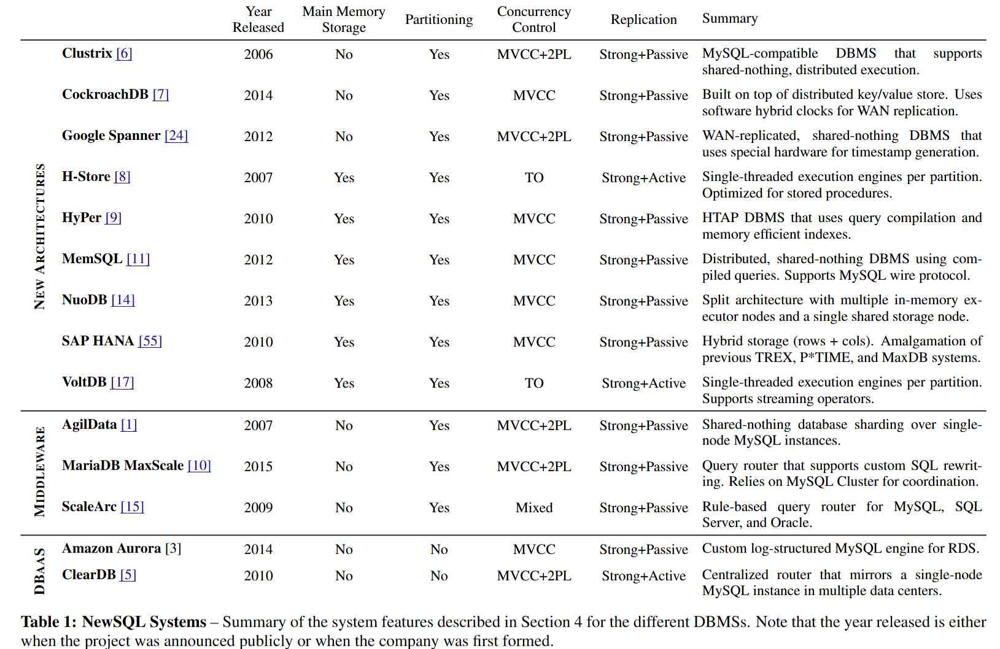

# What’s Really New with NewSQL?

# Abstract

一种被称为NewSQL的数据库管理系统（DBMS）类宣称，它们能够以传统系统无法做到的方式扩展现代在线事务处理（OLTP）工作负载。术语NewSQL最早由本文的其中一位作者在2011年的一份商业分析报告中使用，报告讨论了新兴数据库系统作为挑战者对抗这些老牌供应商（如Oracle、IBM、Microsoft）的崛起。另一位作者则致力于开发后来成为第一个NewSQL DBMS的系统之一。自那时以来，几家公司和研究项目（无论是正确还是错误地）都使用了这一术语来描述他们的系统。

鉴于关系型DBMS已经存在了四十多年，因此我们有理由问，NewSQL的优越性声明是否真的成立，还是仅仅是市场营销的产物。如果它们的确能够提供更好的性能，那么接下来的问题是，是否存在什么科学上的创新，使得它们能够实现这些性能提升，还是仅仅因为硬件已经取得了巨大进展，以至于过去的瓶颈现在不再是问题。

为了回答这个问题，我们首先回顾数据库的历史，以便理解NewSQL系统是如何产生的。然后，我们将详细解释NewSQL这一术语的含义以及归入这一定义的不同系统类别。

# 1. A BRIEF HISTORY OF DBMSS

第一批数据库管理系统（DBMS）出现在1960年代中期。最早的之一是IBM的IMS，它用于跟踪土星V号和阿波罗太空探索项目的供应品和零件库存。IMS帮助引入了一个理念，即应用程序的代码应该与它操作的数据分开。这使得开发人员能够编写只专注于数据访问和操作的应用程序，而不必处理如何实际执行这些操作时的复杂性和开销。IMS之后，1970年代初期的开创性工作，IBM的System R和加利福尼亚大学的INGRES，标志着第一个关系型DBMS的诞生。INGRES很快在其他大学的信息系统中得到采用，并在1970年代末商业化。与此同时，Oracle发布了其类似于System R设计的首个DBMS版本。其他公司也在1980年代初期成立，试图复制首批商业DBMS的成功，包括Sybase和Informix。尽管IBM从未将System R公开发布，但它后来在1983年发布了一种新的关系型DBMS（DB2），该系统使用了System R部分代码库。

1980年代末和1990年代初，出现了一类新的DBMS，旨在克服关系模型与面向对象编程语言之间广为宣传的阻抗不匹配问题。然而，这些面向对象的DBMS未能获得广泛的市场采用，因为它们缺乏像SQL这样的标准接口。但它们的许多理念最终被主要供应商在十年后加入到关系型DBMS中，十多年后，又被纳入面向文档的NoSQL系统中。

1990年代的另一个重要事件是今天两个主要的开源DBMS项目的开始。1995年，MySQL在瑞典启动，基于早期的ISAM数据库系统mSQL。PostgreSQL则始于1994年，当时两位伯克利的研究生从1980年代的原始QUEL-based Postgres代码中分支出来，增加了对SQL的支持。

2000年代，随着互联网应用的到来，新的应用程序需要处理比以前应用程序更具挑战性的资源需求。它们需要扩展以支持大量的并发用户，并且必须始终在线。然而，这些新应用程序的数据库通常成为瓶颈，因为资源需求远超当时DBMS和硬件的支持能力。许多公司尝试了最直观的解决方案：通过将数据库迁移到更强大硬件的机器上，垂直扩展其DBMS。然而，这样做只能提高一定程度的性能，而且随着资源需求的增加，效果逐渐递减。此外，将数据库从一台机器迁移到另一台机器是一个复杂的过程，通常需要大量的停机时间，这对于这些基于Web的应用程序来说是不可接受的。为了克服这个问题，一些公司创建了定制的中间件，将单节点DBMS分割到一组价格较低的机器上。该中间件向应用程序呈现一个单一的逻辑数据库，数据存储在多个物理节点上。当应用程序发出查询时，中间件会重定向并/或重写它们，以将查询分发到集群中的一个或多个节点。各个节点执行这些查询并将结果返回给中间件，中间件随后将它们合并为一个单一的响应返回给应用程序。eBay的基于Oracle的集群和Google的基于MySQL的集群就是这种中间件方法的典型示例。Facebook后来的MySQL集群也采用了这一方法，直到今天仍在使用。

分片中间件适用于像读取或更新单个记录这样的简单操作。然而，对于需要更新多个记录或进行表连接的查询来说，它执行起来更加困难。因此，这些早期的中间件系统不支持这类操作。例如，eBay在2002年的中间件要求开发人员在应用程序级别实现所有连接操作。

最终，一些公司放弃了使用中间件，开发了自己的分布式DBMS。其动机有三个方面。**首先，当时传统的DBMS专注于一致性和正确性，而忽视了可用性和性能。然而，这种权衡被认为不适合需要全天候在线且必须支持大量并发操作的Web应用程序。**其次，人们认为使用像MySQL这样的全功能DBMS作为“傻”数据存储存在太多开销。同样，也有人认为关系模型并不是表示应用程序数据的最佳方式，使用SQL对于简单的查询来说是过度的。

**这些问题成为了2000年代中后期NoSQL运动的起源。**NoSQL系统的关键特点是，<u>它们放弃了传统DBMS的强事务保证和关系模型，转而采用最终一致性和替代数据模型（如键/值、图形、文档）。</u>这是因为人们认为，现有DBMS的这些方面限制了它们扩展的能力，无法实现Web应用所需的高可用性。最著名的两个系统是<u>Google的BigTable和Amazon的Dynamo</u>。最初这两个系统仅在各自的公司内部使用（尽管现在作为云服务向外提供），因此其他组织创建了它们的开源克隆，包括Facebook的Cassandra（基于BigTable和Dynamo）和PowerSet的Hbase（基于BigTable）。其他初创公司也创建了自己的系统，这些系统未必是Google或Amazon系统的复制品，但仍然遵循NoSQL哲学的原则，其中最著名的是MongoDB。

到2000年代末，已经有了一系列多样化、可扩展且更为廉价的分布式DBMS。使用NoSQL系统的优势（至少人们当时认为）是开发人员可以专注于他们的应用程序中对业务或组织更有利的方面，而不必担心如何扩展DBMS。然而，许多应用程序无法使用这些NoSQL系统，因为它们无法放弃强一致性和事务要求。这对于处理高价值数据的企业系统（如金融和订单处理系统）来说很常见。最著名的Google发现，NoSQL DBMS让他们的开发人员花费太多时间编写代码来处理不一致的数据，使用事务可以提高他们的生产力，因为事务提供了一个有用的抽象，更易于人为推理。<u>因此，这些组织唯一的选择就是购买更强大的单节点机器，垂直扩展DBMS，或开发自定义支持事务的分片中间件。这两种方法都非常昂贵，因此对许多组织来说并不可行</u>。**正是在这种环境下，NewSQL系统应运而生。**

> 因此，无论是NoSQL还是传统DBMS：要么垂直扩展，要么采用支持自定义事务的分片中间件进行水平扩展，扩展方法都较为昂贵。

## 1.1 传统DBMS和NoSQL比较

传统 DBMS 和 NoSQL 的特性及对比如下：

传统 DBMS ：

- **发展历程**：第一批 DBMS 出现在 1960 年代中期，如 IBM 的 IMS；1970 年代初期出现关系型 DBMS，如 IBM 的 System R 和加利福尼亚大学的 INGRES 等；1980 年代末和 1990 年代初出现面向对象的 DBMS 但未广泛采用；1990 年代开始出现重要的开源 DBMS 项目如 MySQL 和 PostgreSQL。
- **数据模型**：以关系模型为主，如关系型 DBMS 使用表结构来组织数据。
- **事务保证**：专注于一致性和正确性，提供强事务保证，确保数据的完整性和准确性。
- **接口**：部分拥有标准接口，如 SQL，用于数据的访问和操作。
- **性能与扩展性**：在处理大量并发用户和始终在线的需求时，容易成为瓶颈，垂直扩展（迁移到更强大硬件）效果有限且过程复杂，会造成大量停机时间。

NoSQL 特性：

- **发展历程**：起源于 2000 年代中后期，为解决传统 DBMS 不适合 Web 应用需求的问题而产生，如 Google 的 BigTable 和 Amazon 的 Dynamo，随后出现许多开源克隆及其他遵循 NoSQL 哲学的系统。
- **数据模型**：放弃关系模型，采用替代数据模型，如键 / 值、图形、文档等。
- **事务保证**：放弃传统 DBMS 的强事务保证，采用最终一致性。宽松的一致性要求使得NoSQL在水平扩展时的限制更少，更容易。
- **接口**：缺乏像 SQL 这样的标准接口（早期面向对象的 DBMS 就因此未广泛采用，NoSQL 一定程度上延续了这种情况）。
- **性能与扩展性**：更适合处理互联网应用中大量并发用户和始终在线的需求，可扩展性强，开发人员可专注于应用程序对业务有利的方面，不必担心 DBMS 扩展问题。

# 2.THE RISE OF NEWSQL

**我们对NewSQL的定义是：它们是一类现代关系型数据库管理系统（DBMS），旨在为在线事务处理（OLTP）读写负载提供类似NoSQL的可扩展性能，同时仍然保持事务的ACID保证。**换句话说，这些系统希望实现与2000年代NoSQL数据库相同的可扩展性，但仍保留1970–1980年代遗留DBMS的关系模型（带SQL）和事务支持。这使得应用程序能够执行大量并发事务，用SQL（而非专有API）摄取新信息并修改数据库状态。如果应用程序使用NewSQL DBMS，则开发人员无需编写逻辑来处理像NoSQL系统那样的最终一致性更新。如我们下文所述，这种解释涵盖了许多学术和商业系统。

需要注意的是，有一些数据仓库DBMS出现在2000年代中期，某些人认为它们符合这一标准（例如，Vertica、Greenplum、Aster Data）。<u>这些DBMS专注于在线分析处理（OLAP）工作负载，不应被视为NewSQL系统。OLAP DBMS的重点是执行复杂的只读查询（即聚合、多表连接），这些查询处理大数据集时需要较长时间（例如几秒钟甚至几分钟）。每个查询可能与前一个查询有很大不同。</u>

而NewSQL DBMS所针对的应用程序则具有以下特点：执行读写事务（1）短暂（即不会造成用户阻塞），（2）通过索引查找接触数据的小子集（即不进行全表扫描或大规模分布式连接），（3）重复性强（即使用不同的输入执行相同的查询）。有些人对NewSQL系统的定义更为严格，要求其实现必须采用（1）无锁并发控制方案，和（2）share-nothing的分布式架构[57]。我们在第三节中归类为NewSQL的所有DBMS确实共享这些特性，因此我们同意这一评估。

# 3.CATEGORIZATION

根据上述定义，我们现在来考察当前NewSQL DBMS的格局。为了简化分析，我们将基于这些系统的关键实现特性进行分类。我们认为NewSQL系统主要可以分为以下三类：

1. **全新架构**：从零开始构建的新架构数据库系统。
2. **中间件**：重新实现2000年代Google等公司开发的分片基础设施。
3. **数据库即服务（DBaaS）**：云计算提供商提供的基于新架构的数据库服务。

此前，我们曾将现有**单节点DBMS**的替代存储引擎纳入NewSQL系统的分类，例如MySQL的InnoDB替代品（如TokuDB、ScaleDB、Akiban、deepSQL）。采用新存储引擎的优势在于，组织可以在不更改应用程序的情况下获得更好的性能，同时仍然可以利用DBMS现有的生态系统（如工具、API）。其中最有趣的是ScaleDB，它在系统内部提供透明的分片，而无需使用中间件，而是通过存储引擎之间的执行重分布来实现。然而，该公司后来转向了其他领域。其他类似扩展也出现在MySQL以外的系统中，例如微软SQL Server的内存OLTP引擎Hekaton，它与传统的磁盘驻留表几乎无缝集成。另一些系统则利用PostgreSQL的外部数据封装（foreign data wrapper, FDW）和API钩子来实现类似的集成，但主要针对OLAP工作负载（如Vitesse、CitusDB）。

然而，我们现在认为，这些**单节点DBMS**的存储引擎和扩展不能代表NewSQL系统，因此不再将其纳入分类。MySQL的InnoDB在可靠性和性能方面已经显著改进，因此对于OLTP应用而言，切换到其他引擎的收益并不显著。我们承认，在OLAP工作负载中，从行存储InnoDB切换到列存储引擎（如Infobright、InfiniDB）可能带来更大的收益。<u>但总体而言，替换MySQL存储引擎以优化OLTP工作负载的业务已成为失败数据库项目的“墓地”。</u>

> 在OLTP（在线事务处理）场景下，尝试通过替换MySQL的默认存储引擎（InnoDB）来提升性能的项目，大多数最终都失败了。也就是说，许多公司或研究团队曾经尝试开发新的存储引擎（如TokuDB、ScaleDB、deepSQL等）来取代InnoDB，期望提升MySQL的性能，但这些项目要么未能获得市场认可，要么公司转向了其他领域，最终大多失败，类似于一个“数据库项目的墓地”。

## 3.1 New Architectures

这一类别的NewSQL系统最具研究价值，因为它们是从零构建的全新DBMS，而不是扩展现有系统（如SQL Server的Hekaton）。这些系统的代码基全新设计，避免了传统DBMS的架构包袱。所有此类别的DBMS都基于**共享无关（shared-nothing）**的分布式架构，并具备以下核心能力：

- **多节点并发控制**
- **通过复制实现容错**
- **流控（flow control）**
- **分布式查询处理**

使用专门为分布式执行设计的新DBMS的优势在于，系统的所有部分都可以针对多节点环境进行优化，例如查询优化器和节点间通信协议。例如，大多数NewSQL DBMS可以直接在节点间传输查询（intra-query）数据，而不像某些中间件系统那样必须先路由到中央位置。

> **inter-query**（多个查询间并行）：Inter-query 并行是指**多个独立的查询**在分布式系统中**同时执行**。每个查询可能由不同的用户或应用程序发起，系统通过并行处理这些查询来提高整体吞吐量。
>
> **intra-query**（同一查询内并行）：Intra-query 并行是指**单个查询**在分布式系统中被**分解为多个子任务**，这些子任务在多个节点上**并行执行**，最后将结果合并返回。

除了Google Spanner以外，这一类别的所有DBMS都自行管理主存储（无论是内存型还是磁盘型）。这意味着DBMS采用<u>自定义存储引擎</u>来管理数据库的分布，而不依赖于现成的分布式文件系统（如HDFS）或存储层（如Apache Ignite）。<u>这一特性至关重要，因为它使DBMS能够**“将查询发送到数据”而不是“将数据带到查询”**，从而显著减少网络流量。</u>相比之下，传输查询的网络成本通常远低于传输完整的数据（包括元组、索引和物化视图）。

> 新架构的NewSQL DBMS应该有自研的存储引擎。

此外，NewSQL DBMS可以实现比HDFS块级复制更复杂的复制方案。这使得这些系统能够提供比其他依赖现有技术的系统更高的性能，例如“Trafodion”和“Splice Machine”等基于HBase的SQL-on-Hadoop系统，它们在HBase之上提供事务支持。因此，我们认为这些系统不应被归类为NewSQL。

当然，基于新架构的DBMS也有其劣势。首先，许多组织对采用过于新颖、未经大规模验证的技术持谨慎态度。这意味着，与主流DBMS供应商相比，这些新DBMS的用户群较小，熟练掌握该系统的专业人员也更少。此外，企业可能无法继续使用已有的管理和报告工具。一些DBMS（如Clustrix和MemSQL）通过兼容MySQL协议来缓解这一问题，从而降低迁移成本。

**代表性NewSQL DBMS：**Clustrix [6]， CockroachDB [7]， Google Spanner [24]， H-Store [8]， HyPer [39]， MemSQL [11]，NuoDB [14]，SAP HANA [55]，VoltDB [17]。

## 3.2 Transparent Sharding Middleware（透明分片中间件）

现在市面上已经有产品提供与2000年代eBay、Google、Facebook等公司开发的分片中间件相同的功能。这些产品允许组织将数据库拆分为多个分片，并将其存储在一组单节点DBMS实例上。分片与1990年代的数据库联邦技术不同之处在于：（1）每个节点运行相同的DBMS，（2）每个节点仅存储整个数据库的一部分，（3）不打算由独立的应用程序单独访问和更新。

中央中间件组件负责查询路由、事务协调，以及数据放置、复制和分区管理。通常，每个DBMS节点上都会安装一个shim层，该层与中间件通信，负责在本地DBMS实例上代表中间件执行查询并返回结果。整体而言，这些组件使中间件产品能够向应用程序呈现一个逻辑上的单一数据库，而无需修改底层DBMS。

**使用分片中间件的主要优势在于，它通常可以作为现有单节点DBMS的直接替代方案。**如果应用程序已经使用单节点DBMS，则开发人员无需对其进行任何修改即可使用新的分片数据库。**这类中间件系统最常针对MySQL，因此，为了兼容MySQL，中间件必须支持MySQL的wire协议。**Oracle提供了MySQL Proxy和Fabric工具包来实现这一点，但其他厂商则编写了自己的协议处理程序，以避免GPL许可证问题。

尽管分片中间件可以使数据库轻松扩展至多个节点，但这些系统仍需在每个节点上使用传统DBMS（如MySQL、PostgreSQL、Oracle）。这些DBMS基于20世纪70年代开发的磁盘存储架构，因此无法使用专为内存存储优化的存储管理和并发控制方案，而一些基于新架构的NewSQL系统已经能够做到这一点。**以往的研究表明，磁盘存储架构中的传统组件是扩展这些传统DBMS时的一大阻碍，使其无法充分利用更高的CPU核心数和更大的内存容量。**此外，分片中间件在处理复杂查询时可能会导致冗余的查询规划和优化（即，中间件层进行一次查询优化，各个分片DBMS节点再分别进行优化）。不过，这也允许每个节点对查询应用自己的本地优化策略。

> 如字节跳动的RDS MySQL组，当前每个实例仍然是传统的MySQL系统，因此他们采用的分片方法极有可能就是这种方式。

示例系统：AgilData Scalable Cluster 2、MariaDB MaxScale、ScaleArc、ScaleBase。

## 3.3 Database-as-a-Service（数据库即服务）

最后，还有一些云计算提供商提供NewSQL数据库即服务（DBaaS）产品。使用这些服务，组织无需在自己的私有硬件或云托管的虚拟机（VM）上维护DBMS。相反，DBaaS提供商负责管理数据库的物理配置，包括系统调优（例如缓冲池大小）、数据复制和备份。客户仅需获得一个用于连接DBMS的URL，以及用于控制系统的仪表盘或API。

DBaaS客户根据其应用程序的资源使用量进行付费。由于数据库查询在计算资源的使用方式上存在很大差异，DBaaS提供商通常不会像对块存储服务（如Amazon S3、Google Cloud Storage）那样按操作次数计量查询调用次数。相反，客户订阅的定价层会规定最大资源使用阈值（如存储容量、计算能力、内存分配），提供商则保证该阈值内的资源可用性。

与云计算的其他领域一样，由于规模经济效应，大型公司主导了DBaaS市场。但几乎所有DBaaS产品仅提供对传统单节点DBMS的托管实例（如MySQL），典型案例包括Google Cloud SQL、Microsoft Azure SQL、Rackspace Cloud Database和Salesforce Heroku。这些产品仍然使用基于1970年代架构的磁盘存储DBMS，因此不被视为NewSQL系统。一些厂商（如Microsoft）对其DBMS进行了改造，以更好地支持多租户部署。

**我们认为，只有那些基于新架构的DBaaS产品才属于NewSQL。**其中最典型的例子是Amazon在其MySQL RDS产品中推出的Aurora。与InnoDB相比，Aurora的主要特点是采用日志结构化存储管理器，以提高I/O并行性。

例如，ClearDB提供了一款自定义DBaaS，能够部署在所有主要的云平台上。这样做的好处是，数据库可以分布在同一地理区域内的不同云提供商上，以避免因单个服务商宕机导致的停机问题。

**截至2016年，Aurora和ClearDB是此NewSQL类别中仅有的两个产品。**值得注意的是，该领域已有多家公司倒闭（如GenieDB、Xeround），导致客户不得不在这些DBaaS关闭前紧急寻找新的供应商并迁移数据。我们认为这些公司的失败主要是因为它们的产品超前于市场需求，并且在价格上无法与大型厂商竞争。

示例系统：Amazon Aurora、ClearDB。

# 4. THE STATE OF THE ART

接下来，我们将讨论NewSQL DBMS的特性，以了解这些系统是否真正具有创新性。我们的分析总结见表1。

## 4.1 主内存方式存储（Main Memory Storage）

所有主要的DBMS仍然使用基于20世纪70年代数据库系统的磁盘存储架构。在这些系统中，数据库的主要存储位置被假定为块寻址的持久化存储设备，如SSD或HDD。由于对这些设备的读写速度较慢，DBMS会利用内存缓存从磁盘读取的数据块，并缓冲事务的更新。这种设计在过去是必要的，因为内存相比磁盘更昂贵，容量也更有限。然而，现在的内存容量和价格已经发展到可以负担得起将几乎所有OLTP数据库完全存储在内存中的程度。

<u>这种方式的好处在于，DBMS不再需要假设事务可能随时访问尚未加载到内存中的数据，从而避免了等待磁盘I/O的开销。因此，这些系统可以获得更好的性能，因为许多原本用于处理这些情况的组件（如缓冲池管理器或重量级并发控制机制）已经不再需要[38]。</u>

目前已有多个基于主存架构的NewSQL DBMS，包括学术系统（如H-Store、HyPer）和商业系统（如MemSQL、SAP HANA、VoltDB）。**由于这些系统完全基于内存存储，它们在OLTP工作负载中的性能远远优于基于磁盘的DBMS。**

将数据库完全存储在主存中的想法并不新鲜[28, 33]。早在20世纪80年代，美国威斯康星大学麦迪逊分校的研究就奠定了主存数据库的许多基础[43]，包括索引、查询处理和恢复算法。同一时期，第一个分布式主存数据库PRISMA/DB也被开发出来[40]。进入20世纪90年代，商业主存数据库开始出现，其中包括Altibase[2]、Oracle的TimesTen[60]和AT&T的DataBlitz[20]等。

在NewSQL系统中，主存数据库的新特性之一是能够将部分数据逐出到持久化存储，以减少内存占用。**这使得DBMS能够支持超过主存容量的大型数据库，而无需回到传统的磁盘存储架构。**通常的做法是使用系统内部的跟踪机制，识别出未被访问的元组，并将其逐出。例如，H-Store的反缓存（anti-caching）组件会将冷数据移动到磁盘存储，并在数据库中安装“墓碑”记录，用于标注数据的原始存储位置[25]。当事务访问到墓碑记录时，该事务会被终止，并由独立线程异步检索数据并重新加载到内存中。

> H-Store：墓碑记录说明该记录已经失效，若需要访问该记录需要从磁盘中重新加载。

另一种支持超大内存数据库的方法来自EPFL的一项学术研究，该研究在VoltDB中使用了操作系统的虚拟内存分页机制[56]。为了避免误判，这些DBMS都会在数据库索引中保留被逐出的元组的键，但这会影响节省内存的效果，尤其是在有大量二级索引的应用场景中。尽管微软的Hekaton（不属于NewSQL DBMS）也有类似的方案，但它的Project Siberia[29]项目使用每个索引的Bloom过滤器来减少索引中被逐出元组的内存开销。

另一种不同的方法由MemSQL采用，该系统允许管理员手动指示DBMS将某些表存储为列式格式。MemSQL不会为这些磁盘存储的元组维护任何内存中的元数据，而是采用日志结构化存储（log-structured storage），以减少更新的开销——在传统的OLAP数据仓库中，更新通常较慢。

## 4.2 Partitioning / Sharding（分区/分片）

几乎所有分布式 NewSQL DBMS 的扩展方式都是将数据库拆分为多个不相交的子集，这些子集被称为分区或分片。

在分区数据库上进行分布式事务处理并不是一个新概念，许多相关系统的基础理论可以追溯到 20 世纪 70 年代末 Phil Bernstein 等人在 SDD-1 项目中的开创性研究。到了 20 世纪 80 年代，System R 和 INGRES 这两个先驱级单机 DBMS 的开发团队分别创建了各自的分布式版本。IBM 的 R* 采用了与 SDD-1 相似的share-nothing、面向磁盘的分布式架构，而 INGRES 的分布式版本主要因其动态查询优化算法而被铭记，该算法能够递归地将分布式查询拆解成更小的子查询。随后，威斯康星大学的 GAMMA 项目进一步探索了不同的分区策略。

然而，这些早期的分布式 DBMS 并未得到广泛应用，原因有二：首先，当时计算硬件成本极高，大多数组织难以负担集群数据库的部署；其次，应用程序对高性能分布式 DBMS 的需求尚未显现，当时数据库的峰值吞吐量通常仅在每秒数十到数百个事务的范围内。而如今，这两个假设已不再成立。由于开源分布式系统工具、云计算平台以及廉价移动设备的普及，构建大规模数据密集型应用变得比以往更加容易。

<u>数据库的表通常会被水平划分成多个片段，这些片段的边界基于一个或多个列的值（即分区属性）。DBMS 采用范围分区或哈希分区策略，根据这些属性的值将每个元组分配到相应的片段。多个表的相关片段被合并到同一分区，并由单个节点管理。该节点负责执行所有需要访问其管理数据的查询。仅有少数数据库即服务（DBaaS）系统（如 Amazon Aurora、ClearDB）不支持此类分区。</u>

理想情况下，DBMS 应该能够将查询的执行分发到多个分区，并将结果合并为一个整体。所有支持原生分区的 NewSQL 系统都提供了这一功能，唯一的例外是 ScaleArc。

许多 OLTP 应用的数据库都具备一个关键特性，使其适用于分区：它们的数据库模式可以转换为树状结构，其中树的子节点与根节点之间具有外键关系。<u>因此，可以基于这些关系涉及的属性对表进行分区，使得单个实体的所有数据都存储在同一个分区。</u>例如，树的根可能是客户表，数据库的分区方式确保每个客户及其订单记录和账户信息被存储在同一个分区内。这种设计的好处是，使大多数（甚至全部）事务仅需访问单个分区，从而减少系统的通信开销，因为系统无需使用诸如两阶段提交（2PC）之类的原子提交协议来保证多个节点上的事务正确完成。

NewSQL DBMS 中有两个系统的架构不同于传统的同构集群架构：NuoDB 和 MemSQL。在 NuoDB 中，部分节点被指定为存储管理器（SM），每个 SM 负责存储数据库的一个分区。SM 会将数据库拆分为更小的块（在 NuoDB 术语中称为“原子”）。集群中的其他节点被指定为事务引擎（TE），它们充当原子的内存缓存。处理查询时，TE 节点会从适当的 SM 或其他 TE 获取所需的原子，TE 获取元组的写锁，并将对原子的更改广播到其他 TE 和 SM。为了避免原子频繁在节点之间移动，NuoDB 提供了负载均衡方案，以确保经常一起使用的数据驻留在同一 TE 中。这意味着 NuoDB 采用了与其他分布式 DBMS 相同的分区方案，但无需预先对数据库进行分区或识别表之间的关系。

> NuoDB中节点集群有SM和TE两个角色，SM只负责存储，TE负责执行事务，TE可从其他TE、SM中获取所需的"原子"。

MemSQL 采用了一种类似的异构架构，由仅执行查询的聚合器节点（aggregator nodes）和存储实际数据的叶子节点（leaf nodes）组成。这两个系统的主要区别在于如何减少从存储节点到执行节点的数据传输量。NuoDB 通过让 TE 缓存原子来减少其从 SM 读取的数据量，而 MemSQL 的聚合器节点不缓存数据，而是让叶子节点执行部分查询，以减少发送到聚合器节点的数据量；在 NuoDB 中，这种方式不可行，因为 SM 仅仅是一个数据存储系统。这两种架构都能在无需重新分区数据库的情况下，向 DBMS 集群添加额外的执行资源（NuoDB 的 TE 节点，MemSQL 的聚合器节点）。SAP HANA 的一个研究原型也曾探索过这种方法。然而，目前尚不清楚这种异构架构在性能或运维复杂性方面是否优于传统的同构架构（即每个节点既存储数据又执行查询）。

> MemSQL中的叶子节点既支持存储又支持一定程度的查询。

NewSQL 系统中的另一项新特性是部分系统支持**在线迁移（live migration）**。这使得 DBMS 可以在物理资源之间移动数据，以重新平衡负载并缓解热点问题，或者在不中断服务的情况下增加/减少数据库容量。这类似于 NoSQL 系统中的重平衡（re-balancing），但更具挑战性，<u>因为 NewSQL DBMS 必须在迁移过程中保持事务的 ACID 保证。</u>

实现在线迁移的方法主要有两种：第一种方法是将数据库组织为多个**粗粒度的虚拟（逻辑）分区**，并将这些分区分布在物理节点之间，当需要重新平衡时，DBMS 只需在节点之间移动这些虚拟分区。这种方法被 Clustrix 和 AgilData 采用，也常见于 NoSQL 系统如 Cassandra 和 DynamoDB。第二种方法是进行**更细粒度的重新平衡**，通过范围分区来重新分配单个元组或元组集合。这类似于 MongoDB NoSQL DBMS 的自动分片（auto-sharding）功能，被 ScaleBase 和 H-Store 等系统采用。

## 4.3 Concurrency Control

并发控制方案是事务处理 DBMS 最为显著且重要的实现细节之一，因为它影响系统的几乎所有方面。并发控制允许多个用户以多任务方式访问数据库，同时保持每个用户都像是在专用系统上单独执行事务的假象。它本质上提供了系统中的原子性和隔离性保证，因此影响整个系统的行为。

<u>除了系统使用哪种方案外，分布式 DBMS 设计的另一个重要方面是系统是否使用集中式或分散式事务协调协议。</u>在使用集中式协调器的系统中，所有事务的操作必须经过协调器，协调器然后决定是否允许事务继续执行。这与 1970-1980 年代的 TP 监控器（如 IBM CICS、Oracle Tuxedo）使用的方法相同。在分散式系统中，每个节点维护访问其管理的数据的事务状态。节点之间必须协调，判断并发事务是否发生冲突。<u>分散式协调器有利于扩展性，但需要确保 DBMS 节点的时钟高度同步，以便生成事务的全局顺序。</u>

20 世纪 70-80 年代的首批分布式 DBMS 使用了二阶段锁（2PL）方案。SDD-1 是首个专门为跨一组share-nothing节点处理分布式事务而设计的 DBMS，由一个集中式协调器管理。IBM 的 R* 与 SDD-1 相似，主要的不同之处在于，R* 中的事务协调是完全分散的（去中心化）；它采用了分布式 2PL 协议，事务直接在节点上锁定它们访问的数据项。INGRES 的分布式版本也使用了去中心化的 2PL，并进行了集中式死锁检测。

**几乎所有基于新架构的 NewSQL 系统都放弃了 2PL，因为处理死锁的复杂性。**相反，目前的趋势是使用时间戳排序（TO，Timestamp ordering）并发控制的变体，其中 DBMS 假设事务不会执行交叉操作，从而违反可串行化顺序。<u>在 NewSQL 系统中，最广泛使用的协议是分散式多版本并发控制（MVCC），其中 DBMS 在事务更新数据库时会为元组创建新版本。维护多个版本可以使事务即使在另一个事务更新相同的元组时仍能完成。</u>它还允许长时间运行的只读事务在写操作事务进行时不会阻塞。这一协议在几乎所有基于新架构的 NewSQL 系统中都得到了应用，如 MemSQL、HyPer、HANA 和 CockroachDB。尽管这些系统在其 MVCC 实现中进行了工程优化和调整，以提高性能，但该方案的基本概念并不新颖。MVCC 的首次描述是 1979 年 MIT 博士论文中的内容，首个商用 DBMS 使用 MVCC 的系统分别是 1980 年代早期的 Digital VAX Rdb 和 InterBase。值得注意的是，InterBase 的架构是由 Jim Starkey 设计的，他也是 NuoDB 和失败的 Falcon MySQL 存储引擎项目的原始设计师。

<u>其他系统则采用 2PL 和 MVCC 的结合方案。</u>采用这种方法时，事务仍需要在 2PL 方案下获取锁来修改数据库。当事务修改记录时，DBMS 会像在 MVCC 中那样创建该记录的新版本。这一方案允许只读查询避免获取锁，因此不会在写操作事务进行时阻塞。这种方法的最著名实现是 MySQL 的 InnoDB，但它也被 Google 的 Spanner、NuoDB 和 Clustrix 使用。NuoDB 通过采用一种传播协议，将版本信息在节点之间广播，从而改进了原有的 MVCC。

所有中间件和 DBaaS 服务继承了其底层 DBMS 架构的并发控制方案；由于大多数都使用 MySQL，因此它们都是基于 2PL 和 MVCC 的系统。

**我们认为 Spanner（以及其后续版本 F1 和 SpannerSQL）的并发控制实现是 NewSQL 系统中最具创新性的方案之一。**该方案本身基于 2PL 和 MVCC 的结合，这种方案在过去的几十年里有所发展。但 Spanner 的与众不同之处在于，它利用硬件设备（如 GPS、原子时钟）进行高精度时钟同步。DBMS 使用这些时钟为事务分配时间戳，以在广域网中强制执行其多版本数据库的一致视图。CockroachDB 也声称在多个数据中心之间提供类似 Spanner 的事务一致性，但不使用原子时钟。相反，它依赖于一种混合时钟协议，结合了松散同步的硬件时钟和逻辑计数器。

Spanner 还值得注意，因为它标志着 Google 重返使用事务的关键服务。Spanner 的作者甚至表示，与其像 NoSQL DBMS 一样编写代码来处理事务缺失的问题，不如让应用程序员解决由于过度使用事务而导致的性能问题。

最后，唯一一个不使用某种 MVCC 变体的商业 NewSQL DBMS 是 VoltDB。该系统仍使用 TO 并发控制，但与 MVCC 中的事务交错执行不同，VoltDB 在每个分区内安排事务一次执行。它还采用了混合架构，其中单分区事务以分散方式调度，而多分区事务则由集中式协调器调度。VoltDB 根据逻辑时间戳对事务进行排序，然后在分区中按照每个事物的逻辑时间戳依次安排执行，确保每次事务执行时拥有该分区的独占访问权限，因此系统无需对数据结构进行精细粒度的锁定。这使得只需访问单个分区的事务能够高效执行，因为没有其他事务的争用。

基于分区的并发控制的缺点是，当事务跨多个分区时，网络通信延迟会导致节点在等待消息时处于空闲状态。分区基础的并发控制并不是一个新概念，早期的变体首次由 Hector Garcia-Molina 在 1992 年的论文中提出，并在 1990 年代末的 kdb 系统和 HStore（VoltDB 的学术前身）中得到了实现。

总体而言，我们认为 NewSQL 系统中核心的并发控制方案没有什么显著的新颖之处，唯一的创新在于这些算法在现代硬件和分布式操作环境下的工程优化，使它们能够更好地发挥作用。

## 4.4 Secondary Indexes

二级索引包含来自表的一个子集属性，这些属性与主键不同。这样，DBMS 可以支持快速的查询，超越主键或分区键查找。对于非分区 DBMS 来说，二级索引的支持相对简单，因为整个数据库位于单个节点上。然而，在分布式 DBMS 中，二级索引的挑战在于，它们无法像数据库的其他部分那样总是以相同的方式进行分区。例如，假设数据库的表是根据客户表的主键进行分区的。但如果有一些查询需要根据客户的电子邮件地址反向查找账户信息，由于表是按主键分区的，DBMS 就必须将这些查询广播到每个节点，显然效率低下。

支持分布式 DBMS 中二级索引的两项设计决策是：(1) 系统将在哪里存储这些索引；(2) 如何在事务的上下文中维护它们。在具有集中式协调器的系统中，例如使用分片中间件时，二级索引可以存储在协调器节点和分片节点上。这种方法的优点是整个系统中只有单个版本的索引，因此维护起来较为简单。

<u>所有基于新架构的 NewSQL 系统都是分散式的，并使用分区二级索引。这意味着每个节点存储索引的一部分，而不是每个节点都有完整的副本。</u>分区索引与复制索引之间的权衡在于，使用前者时查询可能需要跨多个节点进行才能找到所需内容，但如果事务更新了索引，它只需要修改一个节点。对于复制索引，情况正好相反：查找查询只需一个节点即可完成，但每次事务修改了二级索引所引用的属性（即键或值）时，DBMS 必须执行分布式事务，更新所有副本的索引。

**一个例子是 Clustrix 中的分散式二级索引，它结合了这两种概念。**该 DBMS 首先在每个节点上维护一个复制的粗粒度（即基于范围的）索引，映射值到分区。这一映射使得 DBMS 可以使用不是表的分区属性的属性来将查询路由到适当的节点。然后，这些查询会访问该节点上的第二个分区索引，映射精确值到元组。这样的两层方法减少了在整个集群中保持复制索引同步所需的协调量，因为它只映射范围而不是单独的值。

当使用不支持二级索引的 NewSQL DBMS 时，开发人员通常会使用内存中的分布式缓存（如 Memcached）来创建二级索引。但使用外部系统意味着应用程序需要自己维护缓存，因为 DBMS 不会自动使外部缓存失效。

## 4.5 Replication

确保 OLTP 应用程序具有高可用性和数据持久性的最佳方式是对数据库进行复制。所有现代 DBMS，包括 NewSQL 系统，都支持某种形式的复制机制。数据库即服务（DBaaS）在这方面具有明显优势，因为它们屏蔽了复制设置的所有复杂细节，使用户可以轻松部署复制数据库，而无需管理员操心日志传输和节点同步问题。

在数据库复制方面，有两个关键的设计决策。第一个是 DBMS 如何在多个节点之间强制执行数据一致性。在强一致性 DBMS 中，事务的写入操作必须在所有副本上被确认并持久化后，事务才被视为提交（即 durable）。这种方法的优点在于，副本节点可以提供只读查询，同时仍然保持数据一致性。也就是说，一旦应用程序收到事务提交的确认，事务所做的所有修改在未来的任何事务中都是可见的，无论它们访问哪个 DBMS 节点。此外，当某个副本发生故障时，不会出现数据丢失的情况，因为所有其他节点都是同步的。然而，为了维护这种同步，DBMS 需要使用原子提交协议（如两阶段提交协议，2PC）来确保所有副本对事务结果达成一致，这会带来额外开销，并在节点故障或网络分区/延迟时可能导致事务阻塞。这也是为什么 NoSQL 系统通常采用弱一致性模型（即最终一致性），在这种模型下，并非所有副本都必须在 DBMS 通知应用程序写入成功之前确认修改。

**所有已知的 NewSQL 系统都支持强一致性复制。**然而，这些系统在如何确保一致性方面并没有什么本质上的创新。实际上，数据库状态机复制（state machine replication）的基本原理早在 1970 年代就已被研究 [37, 42]。NonStop SQL 是 1980 年代最早使用强一致性复制提供容错能力的分布式 DBMS 之一 [59]。

除了 DBMS 传播更新到副本的时机策略外，还有两种不同的执行模型来执行这种传播。第一种是 **主动-主动（active-active）复制**，即每个副本节点同时处理相同的请求。例如，当事务执行查询时，DBMS 会在所有副本上并行执行该查询。这种方式不同于 **主动-被动（active-passive）复制**，后者是在单个主节点上处理请求，然后 DBMS 再将其结果状态传输到其他副本。大多数 NewSQL DBMS 采用后一种方式，因为它们使用 **非确定性并发控制（non-deterministic concurrency control）**，这意味着它们无法在查询到达主节点时直接将其发送到副本执行，因为副本上的查询执行顺序可能会不同，导致数据库状态在各副本之间出现分歧。这种执行顺序的变化受多个因素影响，包括网络延迟、缓存停顿和时钟偏移等。

另一方面，**确定性 DBMS（deterministic DBMS，如 H-Store、VoltDB、ClearDB）** 不需要额外的协调步骤，因为 DBMS 保证在每个副本上按照相同的顺序执行事务操作，因此数据库状态始终保持一致 [44]。VoltDB 和 ClearDB 还确保应用程序不会执行依赖于 DBMS 之外的信息源的查询（如本地系统时钟），因为这些外部信息源在不同副本上可能有所不同。

NewSQL 系统相较于早期研究的一个不同点是 **广域网（WAN）上的复制**。在现代计算环境下，跨多个地理上分散的数据中心部署系统变得非常普遍。任何 NewSQL DBMS 都可以配置为在 WAN 上同步更新数据，但这会显著降低正常操作的性能。因此，它们通常提供异步复制方式。据我们所知，**Spanner 和 CockroachDB** 是目前仅有的两个可以提供如下功能的 NewSQL 系统：它们优化了在 WAN 上提供强一致性副本的复制方案。Spanner 通过 **原子时钟和 GPS 硬件时钟** 结合 [24]，而 CockroachDB 则采用 **混合时钟（hybrid clocks）** [41] 来实现这一点。

## 4.6 Crash Recovery

NewSQL DBMS 提供容错能力的另一个重要特性是其崩溃恢复机制。与传统 DBMS 主要关注数据更新不丢失不同，现代 DBMS 还需要尽可能减少停机时间。现代 Web 应用需要 7×24 小时在线，任何站点宕机都可能带来高昂的代价。

在没有副本的单节点系统中，传统的恢复方法是在 DBMS 崩溃后重新启动时，从磁盘加载最近的检查点，并回放其预写日志（WAL），以恢复到崩溃前的数据库状态。这种方法的经典实现是 ARIES 方案，由 IBM 研究人员在 1990 年代提出，并被所有主要 DBMS 采用或改进。

然而，在具有副本的分布式 DBMS 中，单节点系统的传统恢复方法并不适用。当主节点崩溃时，系统会提升某个从节点为新的主节点。当原主节点重新上线时，它不能简单地加载最后的检查点并回放 WAL，原因在于 DBMS 在主节点故障期间仍然在继续处理事务，数据库状态已经向前推进。因此，恢复中的节点需要从新的主节点（或其他副本）获取其离线期间错过的更新。

有两种可能的方式来完成这一过程。第一种方法是，恢复节点加载其本地存储的最新检查点和 WAL，然后从其他节点拉取其缺失的日志条目。只要恢复节点能够比新更新写入日志的速度更快地处理日志，它最终就能与其他副本节点保持一致。如果 DBMS 使用物理或逻辑-物理混合结构日志记录方式，这种方法是可行的，因为直接应用日志到元组的时间远远小于执行原始 SQL 语句所需的时间。

为了缩短恢复时间，另一种方法是让恢复节点直接丢弃其原有的检查点，并从系统获取一个新的检查点来进行恢复。这种方法的一个额外好处是，同样的机制可以用于向 DBMS 添加新的副本节点。

中间件和 DBaaS 系统依赖于底层单节点 DBMS 提供的内置机制，但会增加额外的基础设施来支持主节点选举以及其他管理功能。基于新架构的 NewSQL 系统通常结合现成的组件（如 ZooKeeper、Raft）和自己实现的现有算法（如 Paxos）来完成这一过程。这些方法和技术自 1990 年代以来就已广泛应用于商业分布式系统。

# 5. FUTURE TRENDS

我们预计，未来数据库应用的一个重要趋势是能够在最新获取的数据上执行分析查询和机器学习算法。这类负载通常被称为“实时分析”（real-time analytics）或混合事务-分析处理（HTAP），其目标是通过分析历史数据集与新数据的结合来提取洞察和知识。这与上一代传统商业智能（BI）操作不同，后者只能基于历史数据进行分析。**缩短数据分析的响应时间在现代应用中至关重要，因为数据在产生时具有极高的价值，但其价值会随着时间的推移而下降。**

在数据库应用中，支持 HTAP 管道的方式主要有三种。最常见的方法是部署两个独立的 DBMS，一个用于事务处理，另一个用于分析查询。在这种架构下，前端 OLTP DBMS 负责存储所有新产生的事务数据。后台系统使用 ETL（Extract-Transform-Load）工具，将数据从 OLTP DBMS 迁移到后端的数据仓库 DBMS。复杂的 OLAP 查询全部在后端 DBMS 上执行，以避免影响 OLTP 系统的性能。同时，OLAP 系统产生的任何新信息都会推送回前端 DBMS。

另一种流行的系统设计是 Lambda 架构，其核心思想是使用独立的批处理系统（如 Hadoop、Spark）对历史数据进行全面计算，同时利用流处理系统（如 Storm、Spark Streaming）实时处理新数据。在这种分离式架构中，批处理系统会定期重新扫描数据集，并将计算结果批量上传到流处理系统，后者则根据新更新的数据进行增量修改。

**然而，这两种方法都存在固有的问题。**首先，由于数据在不同系统之间的传播时间通常以分钟甚至小时计算，应用程序难以立即对新数据采取行动。其次，管理和维护两个独立的 DBMS 需要额外的运维成本，大型数据库系统的人力管理成本通常占据总拥有成本（TCO）的近 50%。此外，应用开发者需要为多个系统编写查询代码，以便合并来自不同数据库的数据。一些系统试图通过隐藏这种架构拆分来实现单一平台，例如 Splice Machine，但由于需要在 OLTP 系统（HBase）与 OLAP 系统（Spark）之间复制数据，这种方法仍然存在技术上的挑战。

**第三种方法，也是我们认为更优的方案，是采用一个单一的 HTAP DBMS，**该系统既能满足 OLTP 负载的高吞吐、低延迟需求，同时也能支持复杂的、运行时间较长的 OLAP 查询，并可同时处理热数据（事务数据）和冷数据（历史数据）。相比于传统的通用 DBMS，这些新型 HTAP 系统结合了过去十年 OLTP 领域（如内存存储、无锁执行）和 OLAP 领域（如列存储、向量化执行）的技术进步，将二者集成到单一数据库中。

SAP HANA 和 MemSQL 是最早以 HTAP DBMS 自居的 NewSQL 数据库。HANA 通过使用多个执行引擎来实现 HTAP，其中一个引擎用于行存储，适用于事务处理，另一个引擎用于列存储，适用于分析查询。而 MemSQL 则采用两个存储管理器（一个用于行存储，一个用于列存储），但在单一执行引擎中混合使用它们。HyPer 最初是一个以 H-Store 风格并发控制的行存数据库，专注于 OLTP 负载，后来转变为 HTAP 列存架构，并采用 MVCC 以支持更复杂的 OLAP 查询。VoltDB 也调整了市场定位，从强调纯 OLTP 性能转向提供流处理能力。此外，S-Store 项目试图在 H-Store 架构上增加流处理功能。同样，2000 年代中期的专用 OLAP 系统（如 Greenplum）也可能开始增强其 OLTP 支持。

不过，需要注意的是，HTAP DBMS 的崛起并不意味着传统的大型 OLAP 数据仓库将立即消失。在短期内，这些系统仍然是企业前端 OLTP 数据库的通用后端存储。然而，未来数据库联邦技术的复兴将使企业能够跨多个 OLTP 数据库（甚至来自不同供应商）执行分析查询，而无需大规模迁移数据。

# 6.Conclusion

我们的分析主要得出的结论是，NewSQL 数据库系统并不是对现有系统架构的彻底颠覆，而是数据库技术持续演进的下一个阶段。这些系统采用的技术大多早已存在于学术界和工业界的数据库系统中，但过去这些技术往往是分散地在不同系统中独立实现，**而 NewSQL 数据库的创新之处在于将这些技术整合到一个单一平台中。这一过程绝非简单的工程任务，而是分布式计算资源日益丰富和成本降低的副产品，同时也反映了现代应用对数据库系统提出的更高要求。**

从市场角度来看，NewSQL 数据库的未来发展及其可能的影响仍值得关注。由于传统数据库厂商根基稳固且资金充足，NewSQL 系统在市场占有率上的增长面临较大挑战。自从我们首次提出“NewSQL”这一术语以来的五年间，已经有多家 NewSQL 公司倒闭（如 GenieDB、Xeround、Translattice），或转向其他业务领域（如 ScaleBase、ParElastic）。我们的分析以及对多家公司的访谈表明，NewSQL 系统的采用速度相对较慢，尤其是与 NoSQL 数据库在开发者群体中的迅速普及相比。这主要是因为 NewSQL 数据库主要支持事务型负载，而这种负载通常出现在企业级应用中，而企业级应用在选择数据库时往往更加保守。**这一点也可以从 NewSQL 主要用于补充或替换现有关系型数据库（RDBMS）部署，而 NoSQL 主要用于新的应用场景这一事实中得到印证。**

与 2000 年代 OLAP 数据库创业公司的情况不同，彼时几乎所有 OLAP 数据库厂商最终都被大型科技公司收购，而 NewSQL 领域的收购案例寥寥无几。截至目前，仅有一次真正意义上的 NewSQL 收购案，即 2016 年 3 月 Tableau 收购了 HyPer 项目相关的创业公司。其他两个可能的例外情况分别是：（1）Apple 在 2015 年 3 月收购 FoundationDB，但我们不将其视为典型案例，因为 FoundationDB 本质上是一个 NoSQL 键值存储系统，其 SQL 层效率较低；（2）ScaleArc 收购 ScaleBase，但这更像是竞争对手之间的收购，而非传统厂商收购新兴系统。这与 2011 年 Teradata 收购 Aster Data Systems 等 OLAP 领域的典型收购案例截然不同。

相较于收购 NewSQL 创业公司，传统数据库厂商更倾向于通过技术创新来改进自身系统。例如，微软在 2014 年为 SQL Server 添加了 Hekaton 内存计算引擎，以提升 OLTP 负载性能。而 Oracle 和 IBM 在技术创新方面的步伐相对较慢，最近才在其数据库系统中增加了列存储扩展功能，以应对 HP Vertica 和 Amazon Redshift 等 OLAP 数据库的崛起。未来，它们也有可能为 OLTP 负载引入内存计算选项。

**从长期来看，我们认为数据库系统的四大类别将逐渐融合，即：（1）1980-1990 年代的传统数据库，（2）2000 年代的 OLAP 数据仓库，（3）2000 年代兴起的 NoSQL 数据库，（4）2010 年代的 NewSQL 数据库。我们预计，这些系统最终都会支持某种形式的关系模型和 SQL（如果尚未支持的话），同时能够像 HTAP 数据库那样兼顾 OLTP 事务处理和 OLAP 分析查询。当这一趋势成为现实时，NewSQL、NoSQL 乃至 OLAP 这样的分类标签将失去意义。**
