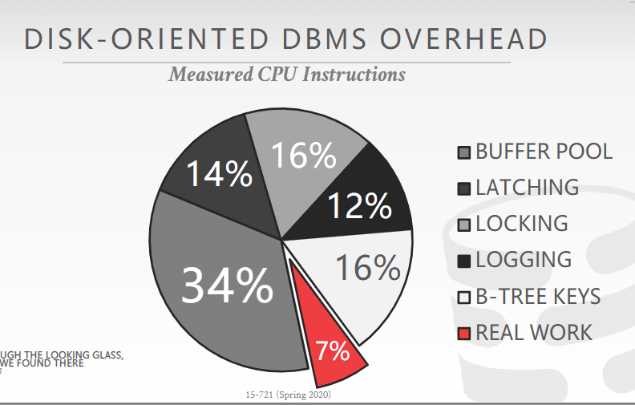
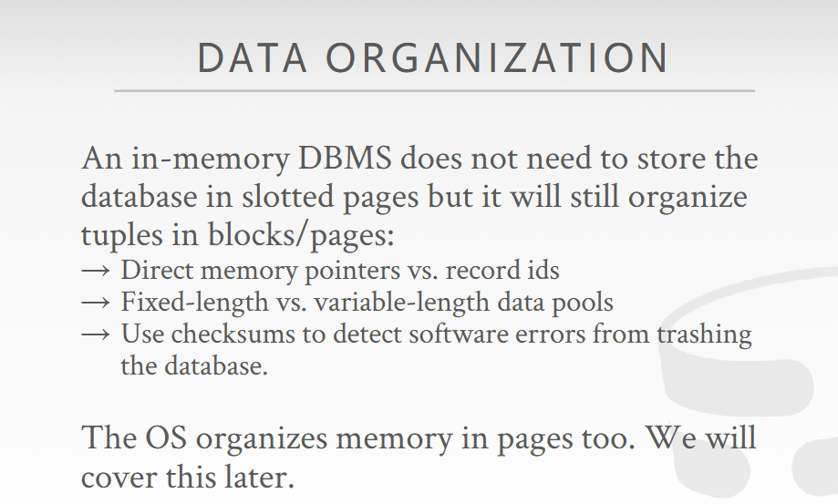
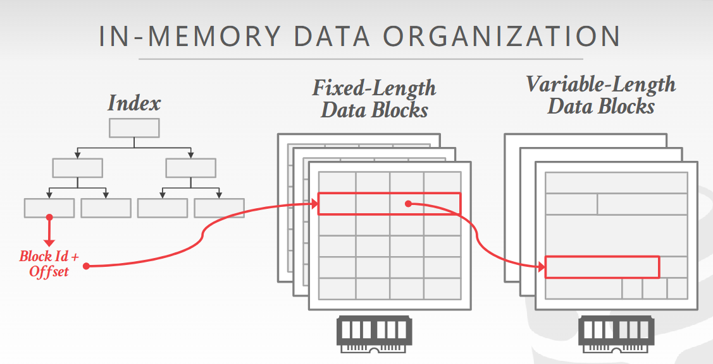

# Disk-Oriented DBMS

基于磁盘的DBMS规定，在运行过程中，若事务需要访问不在内存中的页面，那么该事务总是会阻塞，直到这个页面被获取。

因此并发控制允许别的事务同时进行，以提高运行效率。磁盘类型的DMBS有专门的缓存管理器，类似设计像之前在CMU15445中设计的简易bp管理器。

大多数面向磁盘的DBMS都采用STEAL+NO FORCE的缓存管理策略，

## STEAL+NO-FORCE策略

在数据库管理系统（DBMS）中，**STEAL + NO FORCE** 是一种缓冲池（Buffer Pool）管理策略，主要用于决定何时将脏页（被修改但未写回磁盘的数据页）写回磁盘：

### STEAL 和 NO FORCE 的含义

**STEAL**：**允许“偷取”**：当一个事务未提交时，它的脏页可以被写回磁盘。

- **优点**：可以更灵活地管理缓冲池空间，避免内存不足。
- **缺点**：如果事务最终回滚，需要额外的机制（如日志）来恢复数据。

**NO FORCE**：**不强制写回**：事务提交时，不强制将其脏页立即写回磁盘。

- **优点**：减少磁盘I/O，提高性能。
- **缺点**：如果系统崩溃，未写回磁盘的脏页可能会丢失，需要依赖日志来恢复。

**STEAL + NO FORCE** 是两种策略的组合：

1. **STEAL**：允许未提交事务的脏页被写回磁盘。
2. **NO FORCE**：事务提交时，不强制将脏页立即写回磁盘。

**通俗理解**：
- 缓冲池就像一个临时工作台，事务可以在上面修改数据页。
- **STEAL** 的意思是，如果工作台满了，可以把一些未完成的工作（未提交的脏页）暂时存到仓库（磁盘）里，腾出空间。
- **NO FORCE** 的意思是，即使工作完成了（事务提交了），也不急着把工作成果存到仓库里，可以等合适的时候再存。

### 总结

更高效地利用缓冲池空间。减少磁盘I/O，提高性能。

但需要依赖日志（如WAL，Write-Ahead Logging）来保证数据一致性；系统崩溃后，恢复过程可能更复杂。

假设有一个事务A修改了数据页P1和P2：
1. **STEAL**：即使事务A还没提交，缓冲池空间不足时，P1可以被写回磁盘。
2. **NO FORCE**：事务A提交时，P1和P2不需要立即写回磁盘，可以继续留在缓冲池中，等待合适的时机写回。

## Disk-Oriented DBMS OVERHEAD

若所有数据都能在内存中，那么脏页概念显然就不存在了，从这个角度出发，会带来很多不必要的开销，如上图所示。我们可以认为redo log是在STEAL+NO-FORCE策略下的产物，因此很多开销都可以避免，因为上述BP、LATCH、LOCK、LOGGING等开销都与面向磁盘的设计有。

## 补充：脏页管理策略与redo log和undo log

### STEAL+NO-FORCE

是当前多数面向磁盘类型数据库采取的策略，因为主要瓶颈在于磁盘IO。

**Redo Log（重做日志）** 是 **STEAL + NO-FORCE** 策略下的一个重要产物，用于保证数据的一致性和可恢复性。如果采用不同的缓冲池管理策略，Redo Log 可能并不是必须的。

**STEAL**：允许未提交事务的脏页写回磁盘。如果事务最终回滚，磁盘上的数据可能是不一致的，需要 对应的Redo log来恢复，值得注意的是Undo log同样是会产生redo log的。

**NO-FORCE**：事务提交时，不强制将脏页写回磁盘。如果系统崩溃，未写回磁盘的脏页会丢失，需要 Redo Log 来重做这些修改。

因此，**Redo Log 是 STEAL + NO-FORCE 策略下保证数据一致性和可恢复性的关键机制**。

如果采用不同的策略，Redo Log 和Undo Log是否必要？

Redo Log：保存系统的修改，确保修改不丢失。

Undo Log：若系统中存在脏页概念，则需要Undo日志，以撤回未提交事务的更改。

### STEAL + FORCE
**STEAL**：允许未提交事务的脏页写回磁盘。

**FORCE**：事务提交时，强制将所有脏页写回磁盘。

**Redo Log 的必要性**：

- 由于事务提交时脏页已经写回磁盘，系统崩溃后不需要 Redo Log 来重做修改；但为了应对系统随时的崩溃，Redo始终是必要的。
- 但为了处理事务回滚（未提交的脏页可能已经写回磁盘），仍然需要 **Undo Log（回滚日志）**。

### NO-STEAL + NO-FORCE
**NO-STEAL**：不允许未提交事务的脏页写回磁盘。

**NO-FORCE**：事务提交时，不强制将脏页写回磁盘。

**Redo Log 的必要性**：由于未提交的脏页不会写回磁盘，事务回滚时只需要丢弃缓冲池中的脏页即可，不需要 Undo Log。

- 但由于事务提交时脏页可能未写回磁盘，系统崩溃后仍然需要 Redo Log 来重做这些修改。

### NO-STEAL + FORCE
**NO-STEAL**：不允许未提交事务的脏页写回磁盘。

**FORCE**：事务提交时，强制将所有脏页写回磁盘。

**Redo Log 的必要性**：由于未提交的脏页不会写回磁盘，且提交时脏页已经写回磁盘，undo就不需要了。但系统随时可能崩溃，因此redo仍然必要。

- 这种策略最安全，但性能较差，因为每次提交都需要强制写回磁盘。

### 总结

上面都是理论说法，肯定要根据具体设计去调整。我认为WAL机制在内存数据库中仍然是必要的，因为系统随时可能崩溃掉。

# In-Memory Database设计概要

内存数据库将tuple组织成块或页，但不需要再根据record将页面分成若干个slot。一些区别如下：

- 内存DB中可以直接使用内存指针进行访问记录<blockID, offset*RecordSize>。因为内存DB的Record定长。内存DB为了维持这个特性，会单独存放变长数据记录，以确保索引访问的第一层数据的样子是定长的。
  - 而磁盘DB中使用<pageID，记录ID>。
- 内存DB缓冲池中的record大小是相同的、定长的，变长数据额外存储。
  - 磁盘DB的页面的record是变长的。
- 使用校验和机制检测数据损坏。

## 内存DB的数据管理策略

如上，第一层中，每个Block中的Record都是定长的。因此通过<BlockID, offset*Recordsize>获取到目标Record所在的位置，接下来根据数据定长或变长，采取不同行为：

- 数据定长，可以直接在Record中获取对应字段。
- 数据变长，Record中只存储该数据的指针，需要再次访问获取具体的数据。

通过这种策略维护定长Record的存储方法。

## 内存DB的索引

20世纪80年代那会提出了专门为内存DB设计的索引，但那会CPU Cache的速度和主存差不多，但随着缓存速度远超内存，这些内存优化索引因为没考虑缓存性能，反而比B+树表现更差。

因此，在内存数据库中理论上可以不需要log机制，因为重建索引的成本是比较低的。因此，为了避免日志记录的开销，内存数据库系统通常在重启后会重新构建索引。

## 内存DB的查询处理

在面向磁盘的数据库中，我们主要关心DBMS与磁盘介质交互的开销，因为该开销占比最大，所以那时内存中执行策略、执行算法的开销显得微不足道。

但是，当数据完全在内存中时，查询计划执行策略的变化：由于内存中顺序扫描和随机访问的速度差异不再明显，传统的逐tuple迭代器模型（tuple-at-a-time iterator）因为函数调用开销变得效率低下，尤其是在OLAP（在线分析处理）数据库系统中，这个问题更加突出。因此，需要新的策略来优化内存中的查询执行。

## LOGGING&RECOVERY

即使数据都在内存中，系统仍然需要在非易失性存储（如磁盘）上保留预写日志（WAL），因为系统可能随时崩溃。

- 为了减少日志写入的开销，可以使用**组提交（group commit）**将多个日志条目批量写入，分摊 `fsync` 的成本。
- 此外，由于数据都在内存中，可以采用更轻量级的日志方案（例如只记录重做信息）。

同时，因为没有“脏页”需要写回磁盘，所以不需要在整个系统中跟踪日志序列号（LSNs）。因为脏页概念不存在了，因此Undo日志同样也不需要了。

# 内存数据库设计瓶颈

在内存型数据库中，IO不再是主要瓶颈，因此很多原来在磁盘DBMS中采取的策略变得不再适用，需要改变很多其他部分的组件：

- Locking/latching
- Cache-line misses
- Pointer chasing
- Predicate evaluations
- Data movement & copying
- Networking (between application & DBMS)

同样也是这门课的全部内容的概要提纲。本节课会从Lock/Latching出发，讲并发控制设计的影响。

# Concurrency Control

并发控制机制为数据库系统提供原子性和隔离性。

在内存数据库中，事务获取锁的成本与访问数据的成本相当，因此新的性能瓶颈是多个事务同时访问数据时产生的竞争问题。为了优化性能，DBMS 可以将每个元组（tuple）数据与锁信息一起存储，这有助于提高 CPU 缓存的局部性（cache locality）。

此外，传统的互斥锁（mutex）速度较慢，需要使用更高效的 **比较并交换（Compare-and-Swap, CAS）** 指令来实现锁机制，从而减少竞争开销。

## 悲观（2PL）与乐观协议

**两阶段锁（Two-Phase Locking, 2PL）** 和 **时间戳排序（Timestamp Ordering, T/O）**。

**两阶段锁（2PL）**：

- 假设事务之间会发生冲突，因此事务在访问数据库对象之前必须先获取锁。
- 通过加锁机制确保事务的串行化执行，但可能导致死锁和性能开销。
- 有DL_TECT、NO_WAIT、WAIT_DIE三种死锁处理方法，具体见论文。

**时间戳排序（T/O）**：

- 假设冲突很少发生，因此事务不需要提前加锁，而是在提交时检查冲突。
- 通过时间戳决定事务的执行顺序，避免了锁的开销，但在高冲突场景下可能导致大量事务回滚。

简单来说，2PL 是“先加锁，防冲突”，而 T/O 是“先执行，提交时再解决冲突”。

## **基本 T/O 和 乐观并发控制（Optimistic Concurrency Control, OCC）**

**基本 T/O**：

- 在每次读/写时检查冲突。每次读写时检查Tuple中最新的操作时间戳是否是小于当前操作的，符合则执行，否则不予执行。
- 每次访问时复制元组（tuple），以确保可重复读（repeatable reads）。
- 无论是读写操作都需要记录时间戳。因此开始的时候就会为事务分配时间戳。

**乐观并发控制（OCC）**：

- 将所有修改存储在事务的私有工作区（private workspace）中。
- 在提交时检查冲突，如果没有冲突，则将修改合并到数据库中。 检查分为向前验证和向后验证两个层面。
- 只需要对写操作记录时间戳。事务结束的时候才分配时间戳。

简单来说，**基本 T/O** 是“每次操作都检查冲突”，而 **OCC** 是“先改数据，提交时再检查冲突”。OCC 适合冲突较少的场景，而基本 T/O 更适合需要严格一致性控制的场景。

### 向前验证与向后验证

| **特性**     | **向前验证（Forward Validation）**     | **向后验证（Backward Validation）** |
| :----------- | :------------------------------------- | :---------------------------------- |
| **验证对象** | 正在执行的事务                         | 已提交的事务                        |
| **验证时机** | 当前事务提交时                         | 当前事务提交时                      |
| **优点**     | 尽早发现冲突，减少资源浪费             | 验证开销较小，适合低冲突场景        |
| **缺点**     | 需要维护正在执行事务的读写集，开销较大 | 冲突较多时回滚率较高                |
| **适用场景** | 高冲突场景                             | 低冲突场景                          |

假设有两个事务 T1 和 T2：

**向前验证**：

- T1 提交时，检查正在执行的 T2 是否访问了 T1 的读写集。
- 如果 T2 访问了 T1 的读写集，T1 回滚。防止写写冲突和读写冲突。本质上是防止数据不一致问题。一旦数据被修改，那么事务当前私有缓存中的数据就会失效。

**向后验证**：

- T1 提交时，检查在 T1 执行期间已提交的事务是否修改了 T1 的读写集。
- 如果有已提交的事务修改了 T1 的读写集，T1 回滚。防止写写冲突和读写冲突。本质上是防止数据不一致问题。一旦数据被修改，那么事务当前私有缓存中的数据就会失效。

### TO与OCC区别

|       特性       | **基本 T/O**                         | **OCC**                                       |
| :--------------: | :----------------------------------- | :-------------------------------------------- |
| **冲突检测时机** | 每次读/写操作时                      | 提交时                                        |
| **数据访问方式** | 直接访问数据库，复制元组确保可重复读 | 使用私有工作区，避免直接修改数据库            |
| **提交阶段操作** | 直接提交修改                         | 检查冲突后合并修改或回滚                      |
|   **性能开销**   | 运行时开销较大                       | 提交时开销大，大于T/O，私有缓冲区和两阶段验证 |
|   **适用场景**   | 高冲突、严格一致性控制（如 OLTP）    | 低冲突、读多写少（如 OLAP）                   |

### 时间戳使用方式区别

| **特性**           | **基本 T/O**           | **OCC**                |
| :----------------- | :--------------------- | :--------------------- |
| **时间戳分配时机** | 事务开始时             | 事务提交时             |
| **时间戳作用**     | 用于实时冲突检测       | 用于提交时冲突检测     |
| **时间戳使用方式** | 决定事务执行顺序       | 决定事务提交顺序       |
| **事务行为影响**   | 时间戳直接影响执行行为 | 时间戳主要影响提交行为 |
| **冲突检测时机**   | 每次读/写操作时        | 提交时                 |

简单来说，**基本 T/O** 的时间戳在事务开始时分配，用于实时冲突检测；而 **OCC** 的时间戳在事务提交时分配，用于提交时的冲突检测。前者更严格，后者更灵活。

## 不同协议的瓶颈

论文实验表表明，低竞争（Low Contention）时，乐观协议表现更好，因为事务之间冲突较少，数据库系统（DBMS）不需要频繁检查冲突，减少了开销。而锁争用情况较严重时，无论是乐观协议还是悲观协议，性能都会下降，最终退化为几乎相同的 **串行执行（Serial Execution）**。

因为高竞争下冲突频繁，乐观协议需要频繁回滚事务，而悲观协议需要频繁加锁，两者的开销都很大。

### Lock Thrashing（锁竞争）

2PL的DL_DETECT和WAIT_DIE方式的瓶颈。

当多个事务竞争同一把锁时，每个事务等待锁的时间会变长，导致其他事务也需要等待更长时间。这种现象会显著降低系统性能，因为事务大部分时间都在等待锁，而不是执行有用的工作。

通过移除死锁检测/预防机制开销来缓解这个问题：

- 可以通过强制事务 **按主键顺序加锁** 来避免死锁。
- 按主键顺序加锁确保了事务之间不会出现循环等待，因此 **死锁不可能发生**。

### TimeStamp Allocation

所有基于TO算法的瓶颈，以及2PL中WAIT_DIE的瓶颈。理论上分配时间戳有如下几种方案：

**Mutex（互斥锁）**：**最差的选择**，因为互斥锁的开销较大，尤其是在高并发场景下，会导致性能瓶颈。

**Atomic Addition（原子加法）**：需要 **缓存失效（Cache Invalidation）** 来保证一致性，这会增加额外的开销。

**Batched Atomic Addition（批量原子加法）**：

- 需要一种 **退避机制（Back-off Mechanism）** 来防止资源快速耗尽（fast burn）。
- 虽然比单次原子加法更高效，但实现复杂。

**Hardware Clock（硬件时钟）**：不确定未来的 CPU 是否会支持硬件时钟，因此依赖它的方案可能不可靠。

**Hardware Counter（硬件计数器）**：现有的 CPU 并未实现硬件计数器，因此无法直接使用。

### Memory Allocations

OCC和MVCC的固有瓶颈，因为他们都需要分配临时缓存，而OCC需要的更多更严重，且还有检查行为。

每次读/写访问时复制数据会显著降低 DBMS 的性能，因为这会增加 **内存控制器** 的竞争。**原地更新（In-place Updates）** 和 **非复制读取（Non-copying Reads）** 受内存控制器竞争的影响较小，因此性能更好。

默认的 `libc malloc`（标准库的内存分配函数）速度较慢，不适合高性能 DBMS。后续课程会讨论更高效的内存分配方案。

# 总结

内存DBMS的设计考量与磁盘DBMS存在很大不同。

内存DBMS会是一个趋势，数据在内存中存储和处理也是一个趋势。

**DRAM（动态随机存取存储器）容量的增长近年来已经停滞**，相比之下，**SSD（固态硬盘）的容量增长更快**。
