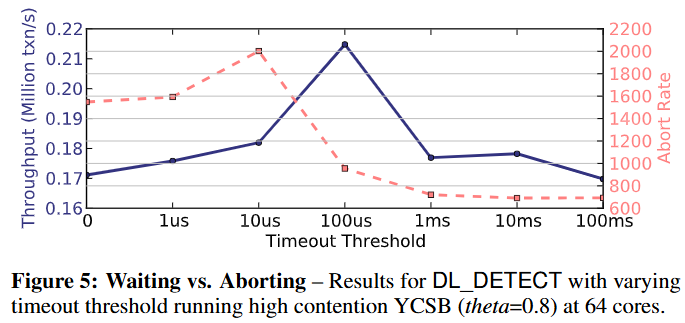
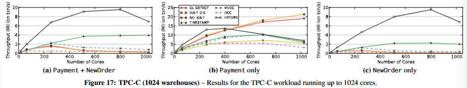

# Staring into the Abyss: An Evaluation of Concurrency Control with One Thousand Cores

# ABSTRACT

计算机架构正迈向一个以多核计算为主导的时代，单个芯片上集成数十甚至数百个核心。这种前所未有的片上并行性为系统的可扩展性引入了全新的挑战，而当前的数据库管理系统（DBMS）并未针对这一趋势进行优化。尤其是，随着核心数量的增加，并发控制问题变得愈发严峻。在数百个线程并行执行的环境下，如何高效协调对数据的竞争访问，将直接影响多核架构所带来的性能提升。

为了深入理解当前 DBMS 在面对未来 CPU 架构时的局限性，我们对多核环境下的在线事务处理（OLTP）工作负载的并发控制机制进行了评估。我们在一个基于主存的 DBMS 中实现了七种不同的并发控制算法，并利用计算机模拟技术将系统扩展至 1024 核心。**实验结果表明，所有算法在这一规模下均未能成功扩展，但失败的原因各不相同。**在每种情况下，我们都识别出了影响可扩展性的核心瓶颈，并指出这些瓶颈独立于具体的数据库实现，即便是最先进的 DBMS 也难以避免。

基于这一研究，我们认为，与其继续追求渐进式优化方案，**不如从根本上重新设计 DBMS 架构，使其与多核硬件深度协同，从底层构建一个面向多核时代的数据库系统。**

# 1. INTRODUCTION

单线程性能指数级增长的时代已经结束。由于功耗限制和架构复杂性问题，芯片设计正在从单核架构转向多核架构。尽管时钟频率在过去几十年里持续增长，但如今已趋于停滞。<u>过去那种复杂的、乱序执行的超标量处理器正逐步被简单的、顺序执行的单发射核心所取代。</u>我们正迈入一个“多核计算”时代，在这种架构下，单个芯片上集成了大量低功耗的小型核心。在当前功耗受限、单线程计算效率低下的情况下，除非出现颠覆性的技术变革，增加核心数量是架构师提升计算能力的唯一现实选择。这意味着，指令级并行和单线程性能将让位于大规模的线程级并行计算。

> 随着摩尔定律的发展，芯片上的晶体管数量越来越多，但功耗和散热问题也日益突出。复杂的超标量乱序执行处理器虽然性能很高，但功耗也很大。为了在有限的功耗下提高计算能力，芯片设计师开始转向多核设计，即在单个芯片上集成多个简单的、低功耗的核心。

随着摩尔定律的持续推进，单个芯片上的核心数量预计将继续呈指数级增长。不久之后，我们或将迎来百核甚至千核的处理器架构。在这种背景下，单节点共享内存数据库管理系统（DBMS）的可扩展性变得尤为关键。然而，如果当前数据库技术无法适应这一变化，那么这些计算资源将因架构瓶颈而被浪费，多余的核心也将形同虚设。

本文旨在探讨这种未来场景，并分析在千核架构下事务处理系统将面临的挑战。我们并未涵盖所有可能的可扩展性问题，而是聚焦于数据库系统的关键组件之一——并发控制。随着数百个线程的并行运行，对数据访问进行协调的复杂性将成为可扩展性的主要瓶颈，并可能抵消多核架构带来的计算性能提升。因此，我们希望通过深入研究并发控制机制，全面评估 OLTP 数据库系统的可扩展性。

为此，我们在一个基于主存的数据库系统中实现了七种不同的并发控制算法，并利用高性能分布式 CPU 模拟器将系统扩展至 1000 核心。通过从零开始实现系统，我们能够避免现有数据库系统中可能存在的架构性瓶颈，从而更清晰地揭示算法本质上的可扩展性问题。以往的可扩展性研究大多基于现有数据库系统进行 [24, 26, 32]，但这些系统的许多传统组件并未针对多核 CPU 进行优化。就我们所知，目前尚无研究对多个并发控制算法在千核规模的数据库系统上进行评估。

我们的分析结果表明，所有现有并发控制算法在核心数增加时均难以扩展。在每一种算法的实验中，我们都识别出了影响可扩展性的主要瓶颈，并指出即便是当前最先进的数据库系统也难以避免这些限制。我们认为，解决这一问题需要针对多核架构进行深度协同设计的全新并发控制方案。除了增加核心数量之外，计算机架构师还需要提供硬件级的优化方案，以解决软件难以克服的数据库瓶颈。

本文的主要贡献包括：

- 对七种并发控制机制的可扩展性进行全面评估；
- 首次在 1000 核心架构下对 OLTP 数据库系统进行实验研究；
- 识别出影响并发控制方案的核心瓶颈，并指出这些瓶颈独立于具体数据库系统的实现。

本文余下部分的结构如下：第二节概述了我们评估的并发控制方案，第三节介绍了研究的实验组件。第四节和第五节呈现了分析结果，第六节讨论研究发现，第七节回顾相关研究，第八节探讨未来研究方向。

# 2. CONCURRENCY CONTROL SCHEMES

OLTP 数据库系统负责应用程序中与终端用户交互的部分。终端用户通过前端应用程序发送请求以执行特定功能（例如预订机票座位）。应用程序处理这些请求，并在 DBMS 中执行事务。终端用户既可以是使用个人计算机或移动设备的普通用户，也可以是运行在全球各地的其他计算机程序。

在 OLTP 系统中，事务是对共享数据库执行的一系列操作（例如 SQL 查询）的封装，用于完成某种高级功能 [17]。事务是 DBMS 中的基本变更单元：不允许执行部分事务，并且多个事务对数据库状态的影响等同于这些事务的任意串行执行。现代 OLTP 负载中的事务通常具有以下三个显著特征：(1) 事务生命周期短（即无用户等待），(2) 访问的数据子集较小，通常基于索引查找（即不涉及全表扫描或大规模连接查询），(3) 事务具有高度的重复性（即执行相同的查询，仅输入数据不同）[38]。

OLTP DBMS 需要确保事务执行时满足四个核心属性：(1) 原子性（Atomicity），(2) 一致性（Consistency），(3) 隔离性（Isolation），(4) 持久性（Durability），这些特性合称为 ACID [20]。并发控制机制允许多个终端用户以多程序方式访问数据库，同时保持事务彼此隔离的效果，即提供类似于单用户独占执行的错觉 [3]。并发控制机制在系统中主要负责提供原子性和隔离性保障。

在本研究中，我们对多核环境下的不同并发控制机制进行了评估。按照经典分类，并发控制机制通常属于两阶段锁（Two-Phase Locking, 2PL）或时间戳排序协议（Timestamp Ordering Protocols, TO）[3] 的变体。表 1 总结了这些不同的并发控制方案。

## 2.1 两阶段锁协议（2PL）

两阶段锁协议（Two-Phase Locking, 2PL）是首个被严格证明可确保数据库系统中并发事务正确执行的方法 [6, 12]。在该机制下，事务在对数据库中的某个元素执行读取或写入操作之前，必须先获取相应的锁。具体而言，事务在读取数据前必须获得读锁（read lock），在修改数据前必须获得写锁（write lock）。DBMS 可以针对每个元组（tuple）维护锁，也可以在更高级别（例如表或分区）管理锁 [14]。

锁的持有遵循两条基本规则：(1) 不同事务不能同时持有冲突的锁；(2) 一旦事务释放了某个锁，它将不再允许获取新的锁 [3]。其中，读锁与写锁互斥，写锁之间也互斥。

2PL 的执行流程可分为两个阶段：

- **增长阶段（Growing Phase）**：事务可以不断获取所需的锁，但不能释放任何已获取的锁 [12]。
- **收缩阶段（Shrinking Phase）**：事务一旦释放任何锁，就进入该阶段，并且不再允许获取新的锁。当事务终止（提交或中止）时，所有剩余的锁会自动释放。

2PL 被认为是一种悲观（pessimistic的并发控制策略，它假设事务会发生冲突，因此必须提前获取锁以避免该问题。如果事务无法获取某个元素的锁，则必须等待该锁变为可用。然而，若等待过程得不到控制（即等待时间无限），DBMS 可能会发生死锁（deadlock） [3]。<u>因此，不同 2PL 变体的主要区别在于它们如何处理死锁以及在检测到死锁时采取的措施。本文评估了以下三种 2PL 变体，并对比其在死锁处理上的不同策略</u>：

**2PL with Deadlock Detection（DL_DETECT）**：该方案采用**死锁检测（deadlock detection）**机制，即 DBMS 维护一个等待图（waits-for graph），并周期性地检查是否存在环（即死锁）[19]。一旦检测到死锁，系统会选择一个事务进行中止和重启，以打破循环。在实际应用中，通常使用**集中式死锁检测器**进行环检测，检测器会基于事务已使用的资源（例如持有的锁数量）来选择代价最小的事务进行中止 [3]。

> 在15-445的lab中，采用的这种方式，一旦检测到死锁，杀死当前最年轻的事务（执行时间最短，杀死事务的开销小一些）。

**2PL with Non-waiting Deadlock Prevention（NO_WAIT）**：与 DL_DETECT 机制不同，该方法属于**死锁预防（deadlock prevention）**策略，更加激进。当系统怀疑可能发生死锁时，会**立即中止相关事务** [3]。具体而言，当事务的锁请求被拒绝时，调度器会**直接中止该事务，而不允许其等待**。

**2PL with Waiting Deadlock Prevention（WAIT_DIE）**：该方法也是**死锁预防**的一种策略，但采用**非抢占式（non-preemptive）**方式。在该机制下，每个事务在执行前都会分配一个时间戳，系统根据时间戳决定事务是否可以等待：

- **如果请求锁的事务比当前持锁事务“更老”**（即时间戳更小），则它可以等待锁释放。
- **如果请求锁的事务比持锁事务“更年轻”**（即时间戳更大），则它**直接中止（dies）并重新启动** [3]。

由于该方法基于时间戳顺序进行调度，因此可保证系统不会发生死锁。

## 2.2 Timestamp Ordering（时间戳排序T/O）

时间戳排序（Timestamp Ordering, T/O）并发控制方案在事务执行之前**预先确定**一个全局的事务顺序，并强制 DBMS 按照该顺序执行事务。每个事务在开始执行前都会被分配一个**唯一的、单调递增的时间戳**，DBMS 依据该时间戳决定事务间的冲突操作（如同一数据项上的读/写操作或多个写操作）的执行顺序 [3]。

本研究实现了多种 T/O 方案，它们的主要区别在于：

- 冲突检测的粒度（如按元组 vs. 按分区检测）。
- 冲突检测的时机（如事务执行期间 vs. 事务结束时）。

以下是本研究测试的四种主要 T/O 方案：

### 基础时间戳排序（Basic T/O, TIMESTAMP）

在 Basic T/O 方案中，每当事务对数据库中的元组执行**读**或**写**操作时，DBMS 会检查该事务的时间戳与该元组最近一次读/写事务的时间戳：

- **读操作**：如果当前事务的时间戳**小于**该元组最近一次写操作的时间戳，则拒绝该读请求。
- **写操作**：如果当前事务的时间戳**小于**该元组最近一次读或写操作的时间戳，则拒绝该写请求。

为了保证**可重复读（repeatable read）**，Basic T/O 采用**本地副本**方式存储读查询的结果，而不是使用锁进行保护。当事务被中止后，它会被**赋予新的时间戳**并重新启动。本研究的 Basic T/O 实现与经典 T/O 算法 [3] 相似，但采用**去中心化调度器**以提高扩展性。

> 在Basic T/O中，简单来说，在对某个元组执行操作前，需要看该元组上各操作的最近一次时间戳，读看读和写、写看写：一旦小于记录的不同类型时间戳，则拒绝执行该操作。（即到来读小于近期写、到来写小于近期读、或小于近期写的情况，统统拒绝执行到来的操作）

### 多版本并发控制（MVCC）

在多版本并发控制（Multi-Version Concurrency Control, MVCC）方案中，每次写操作都会**创建一个新的数据版本**，而不会直接覆盖原有数据 [4,5]。每个版本都附带**创建该版本的事务的时间戳**，DBMS 维护所有版本的一个有序列表：

- **读操作**：事务根据其时间戳选择适当的版本进行读取，以保证事务的可串行化顺序。
- **写操作**：创建新的数据版本，而不会立即覆盖旧版本。

MVCC 的一个显著优势在于，**不会因为数据被其他事务覆盖而拒绝读操作**，因此减少了事务的冲突率，提高了并发性能 [5]。

### 乐观并发控制（OCC）

在乐观并发控制（Optimistic Concurrency Control, OCC）方案中，事务的所有**写操作**都存储在**私有工作区（private workspace）**，而不会直接更新数据库 [28]。OCC 主要包括三个阶段：

1. **读取阶段（Read Phase）**：事务执行所有读取和计算操作，并将写入操作存储在私有工作区。
2. **验证阶段（Validation Phase）**：事务提交时，DBMS 检查其读集（read set）是否与任何并发事务的写集（write set）存在重叠。
3. 提交阶段（Commit Phase）：
   - **如果没有冲突**，则事务的写集被正式写入数据库。
   - **如果存在冲突**，则事务被**中止并重新执行**。

OCC 在**内存数据库**场景下表现良好，因为事务在提交前不会修改共享数据，从而**缩短了事务之间的竞争时间** [42]。现代 OCC 方案的代表包括 Silo [42] 和 Microsoft Hekaton [11,29]。本研究实现的 OCC 方案类似于 Hekaton，**采用并行化的验证阶段**，提升了系统的可扩展性 [28]。

### 基于分区的 T/O（H-STORE）

H-STORE 方案采用**分区级别的并发控制**，数据库被划分为**多个互不重叠的内存分区（partitions）**，每个分区由一个**单线程执行引擎**独占管理。该方案的核心机制如下：

- 每个分区由一个**互斥锁**（partition-level lock）保护，事务在访问分区前必须先获取锁。
- 事务在启动前，DBMS **必须预先知道其访问的所有分区** [34]。
- 事务请求到达后，DBMS 为其分配一个时间戳，并将其加入目标分区的**锁获取队列**。
- **执行引擎按照时间戳顺序调度事务**：当一个分区的执行引擎从队列中取出事务时，如果其时间戳是队列中最小的，则授予它对该分区的访问权限 [38]。

该方法的早期代表是 Smallbase [22]，而 H-Store [27] 是其较新的实现。H-STORE 通过严格的分区管理和时间戳排序策略，**最大程度地减少了事务间的竞争**，适用于高吞吐量 OLTP 工作负载。

# 3. MANY-CORE DBMS TEST-BED

由于当前市场上尚无大规模的多核芯片，我们使用Graphite [30] 进行分析。Graphite 是一个 CPU 模拟器，可扩展至 1024 核。为了支持数据库管理系统（DBMS），我们实现了一个仅包含实验所需功能的内存 OLTP 引擎。使用自定义 DBMS 主要有两个原因。首先，我们可以确保系统中除了并发控制之外不存在其他瓶颈，使我们能够在不受其他因素干扰的情况下，单独研究每种方案的基本原理。其次，使用完整的 DBMS 在模拟器中是不现实的，因为模拟器（如 Graphite）通常会带来显著的性能下降（平均减速比可达 10,000 倍）。我们设计的 DBMS 使实验能够在合理的时间内完成。接下来，我们将介绍模拟器的基础架构、DBMS 引擎以及实验中使用的工作负载。

## 3.1 模拟器和目标架构

Graphite [30] 是一个针对大规模多核系统的高效 CPU 模拟器。Graphite 通过为架构中的每个核心创建一个独立的线程，从而运行原生 Linux 应用程序。

如图 1 所示，每个应用程序线程都附加到一个模拟核心线程，该线程可以映射到不同主机上的多个进程。为了提高性能，Graphite 采用周期性同步机制来模拟指令级粒度，同时放宽了时钟周期的精确性。与其他类似的 CPU 模拟器一样，它仅执行应用程序代码，而不会模拟操作系统。

在本研究中，我们将 Graphite 部署在一个由 22 个节点组成的集群上，每个节点配备双路 Intel Xeon E5-2670 处理器和 64GB DRAM。

目标架构是一个基于瓦片（tile）的多核 CPU，每个瓦片包含一个低功耗顺序执行的处理核心、32KB L1 指令/数据缓存、512KB L2 缓存片，以及一个网络路由器。这种设计类似于部分商业化 CPU，例如 Tilera 的 Tile64（64 核）、Intel 的 SCC（48 核）和 Intel 的 Knights Landing（72 核）[1]。所有瓦片通过高带宽的二维网格（2D-mesh）互连，每次跳转的延迟为两个周期。瓦片和网格网络均以 1GHz 频率运行。图 2 显示了 64 核系统的架构示意图。

在本研究中，我们采用共享 L2 缓存配置，因为它是目前商用多核处理器中最常见的末级缓存（LLC）设计。在对比实验中，我们发现，相较于私有 L2 缓存，共享 L2 缓存可显著降低内存访问流量，并提高 OLTP 负载的性能（具体数据未展示）。由于 L2 缓存片分布在不同的瓦片上，模拟的多核系统属于非均匀缓存访问（NUCA）架构，其中 L2 缓存的访问延迟会随着 2D 网格中的距离增加而上升。

## 3.2 DBMS

我们基于 pthreads 在 Graphite 中实现了一个轻量级的内存 DBMS。它以单进程运行，工作线程的数量等于核心数，每个线程被分配到不同的核心。所有数据都存储在内存中，采用行存储（row-oriented）方式。

系统支持基本的哈希索引，并提供可插拔的锁管理器，使我们能够在不同的并发控制方案之间切换。锁管理器和索引支持分区模式（如 H-STORE 方案）或集中式模式。

在实验中，客户端线程并未被模拟，而是由每个工作线程维护一个固定长度的事务队列，并按序执行事务。这样可以减少网络协议开销，因为在模拟器中，网络协议的建模极为复杂。每个事务包含程序逻辑，并在其中嵌入查询调用。查询按照程序逻辑顺序依次执行。

实验过程中，我们收集了吞吐量、延迟和中止率等统计数据。在 DBMS 经过足够长时间的运行，进入稳态后才开始统计数据。此外，DBMS 还记录了每个事务在不同组件中的时间开销 [21]，这些数据被划分为以下六类：

- **USEFUL WORK**：事务实际执行应用逻辑并操作数据的时间。
- **ABORT**：DBMS 回滚已执行事务变更所需的时间。
- **TS ALLOCATION**：系统为事务分配唯一时间戳的时间。对于需要时间戳的并发控制方案，分配开销仅在事务开始时发生一次。
- **INDEX**：事务访问哈希索引所需的时间，包括哈希表桶的低级锁开销。
- **WAIT**：事务的总等待时间，包括等待锁（如 2PL）或等待数据可用（如 T/O）。
- **MANAGER**：事务在锁管理器或时间戳管理器中花费的时间，不包括等待时间。

## 3.3 工作负载

在本研究中，我们在实验平台上实现了两个基准测试：

#### YCSB（Yahoo! Cloud Serving Benchmark）

YCSB 是一组用于评估互联网企业大规模服务负载的基准测试 [8]。在本实验中，我们使用了一个约 20GB 的 YCSB 数据库，包含一个 2000 万条记录的单表。每个记录包括一个主键列，以及 10 个额外的列，每个列存储 100 字节的随机字符串。DBMS 为主键创建了单一哈希索引。

默认情况下，每个 YCSB 事务访问 16 条记录，每次访问可以是读取或更新操作。事务的程序逻辑中不包含额外计算，所有查询都是独立的，即每个查询的输入不依赖于先前查询的输出。

记录的访问模式遵循 Zipfian 分布，该分布由参数 θ 控制，影响基准测试中的争用程度 [18]。当 θ=0 时，所有记录的访问频率相同。当 θ=0.6 或 θ=0.8 时，数据库中 10% 的热点记录分别被约 40% 和 60% 的事务访问。

#### TPC-C

TPC-C 是当前评估 OLTP 系统性能的行业标准基准测试 [40]，由 9 个表组成，模拟基于仓库的订单处理系统。TPC-C 中的所有事务均使用 **WAREHOUSE id** 作为输入参数，该参数是除 ITEM 表外所有表的主外键。

对于需要数据分区的并发控制算法（如 H-STORE），TPC-C 按 WAREHOUSE id 进行分区。本实验仅模拟了 TPC-C 五种事务中的两种（Payment 和 NewOrder），因为它们占总负载的 88%。我们的 TPC-C 实现遵循“良好实践”原则，但省略了工作线程的“思考时间”，即事务执行后立即开始下一个事务，从而避免随着并发事务数增加而扩展数据库规模的需求。

## 3.4 模拟器与真实硬件的对比

为了验证 Graphite 产生的结果是否与真实硬件一致，我们在 Intel Xeon E7-4830 服务器上部署了 DBMS，并执行了一个中等争用的 YCSB 读密集型负载（θ=0.6）。随后，在 Graphite 上使用相同的核心数量运行相同的负载，并对比性能。

图 3 显示，所有并发控制方案在 Graphite 和真实 CPU 上均表现出相同的性能趋势。然而，在图 3b 中，MVCC、TIMESTAMP 和 OCC 方案的相对性能差异有所不同。这是因为 MVCC 方案比其他方案具有更高的内存访问开销，而在双插槽系统中，这些访问的代价更高。而 Graphite 仅模拟单插槽 CPU，因此没有插槽间通信开销。此外，在 32 核情况下，T/O 和 WAIT_DIE 方案的吞吐量下降，原因是跨核心的时间戳分配通信开销增加。我们在第 4.3 节对此问题进行了深入探讨。

# 4. DESIGN CHOICES & OPTIMIZATIONS

本研究的主要挑战之一是设计一个尽可能具备可扩展性的 DBMS 及其并发控制方案。当 DBMS 部署在 1000 核处理器上时，许多实现中的次要因素都会对性能产生负面影响。我们尽最大努力优化每种算法，消除所有可能的可扩展性瓶颈，同时保留其核心功能。大部分优化工作集中在消除共享数据结构，并设计经典算法的分布式版本 [3]。

本节将讨论我们在开发多核 OLTP DBMS 过程中的经验，并重点介绍我们为实现系统可扩展性所做的设计选择。此外，我们分析了 2PL 和 T/O 并发控制方案的基本瓶颈，并展示了硬件支持如何缓解这些问题。针对不同并发控制方案的详细分析将在第 5 节展开。

## 4.1 通用优化（General Optimizations）

首先，我们介绍在所有并发控制方案上均适用的 DBMS 性能优化措施。

### 内存分配

在尝试将 DBMS 扩展到大规模核心数时，我们遇到的第一个限制因素是 `malloc` 函数。使用 Linux 默认的 `malloc`，我们发现 DBMS 在大部分时间内都在等待内存分配。即使对于只读工作负载，这也是一个问题，因为 TIMESTAMP 方案仍然需要为读取操作复制记录，并为访问跟踪数据结构创建内部元数据句柄。我们尝试了优化版本（如 TCMalloc [15] 和 jemalloc [13]），但都未能显著改善性能。

最终，我们通过编写自定义的 `malloc` 解决了这个问题。类似于 TCMalloc 和 jemalloc，我们的分配器为每个线程分配独立的内存池，但不同之处在于，它会根据工作负载自动调整内存池大小。例如，如果基准测试频繁分配大块连续内存，内存池会动态扩展，以摊销单次分配的开销。

### 锁表

正如以往研究指出的 [26, 36]，锁表是 DBMS 中的另一个主要争用点。为了解决这一问题，我们没有使用集中式锁表或时间戳管理器，而是采用了基于记录的锁管理方式，即每个事务仅锁定其需要的记录。该方法提升了可扩展性，但增加了内存开销，因为 DBMS 需要维护额外的锁共享者/等待者元数据。然而，在实践中，这些额外的元数据仅占用几个字节，相对于大型记录来说可忽略不计。

### 互斥锁

访问互斥锁（mutex）是一项昂贵的操作，需要多个消息在芯片上进行传输。使用互斥锁保护的中央临界区会严重限制系统的可扩展性（详见第 4.3 节）。因此，必须避免在关键路径上使用互斥锁。

对于 2PL 方案，最主要的瓶颈是用于保护集中式死锁检测器的互斥锁，而对于 T/O 方案，则是分配唯一时间戳所使用的互斥锁。在接下来的部分，我们将介绍具体的优化方案，以消除对这些互斥锁的依赖。

## 4.2 可扩展的两阶段锁（2PL）

本节将介绍针对 2PL 方案的优化措施。

### 死锁检测

对于 DL_DETECT 方案，我们发现死锁检测算法在多个线程竞争更新其等待图（waits-for graph）时会成为瓶颈。这是因为所有事务都会集中修改一个全局数据结构。为了解决这一问题，我们将数据结构分区到不同的核心，并使死锁检测器完全无锁。

现在，当事务更新等待图时，其线程仅更新本地队列，记录其正在等待的事务，而无需加锁。这一操作是局部的（即无需跨核心通信），因为线程不会写入其他事务的队列。

在执行死锁检测时，线程会搜索等待图中的环，但仅通过读取相关线程的队列，而不会锁定这些队列。尽管这一方法可能无法立即发现新形成的死锁，但它保证在后续检测轮次中能够发现死锁 [5]。

### 锁竞争（Thrashing）

即使改进了死锁检测，DL_DETECT 仍然无法很好地扩展，原因是锁竞争。锁竞争指的是，当一个事务持有锁直到提交时，所有尝试获取相同锁的其他事务都会被阻塞。在高争用环境下，随着并发事务数量增加，锁竞争成为所有 2PL 方案的主要瓶颈。

为了分析锁竞争的影响，我们使用 DL_DETECT 方案执行了一个高写入比例的 YCSB 负载（即 50% 读取 / 50% 更新），其中事务按照主键顺序获取锁。尽管这种方式并不适用于所有工作负载，但它消除了死锁检测的影响，使我们能够更清晰地观察锁竞争带来的影响。

图 4 显示了不同争用程度下事务吞吐量随核心数量的变化趋势。当负载没有倾斜（θ=0）时，锁竞争较低，吞吐量几乎呈线性增长。然而，随着争用水平增加，锁竞争逐渐显现。在中等争用（θ=0.6）时，吞吐量在几百个核心达到峰值，随后因锁竞争下降。在高争用（θ=0.8）时，DBMS 吞吐量在 16 核达到峰值，之后无法继续扩展。仿真结果表明，在这种情况下，几乎所有执行时间都花费在等待获取锁上。**因此，锁竞争是基于锁的并发控制方案在高争用环境下的主要可扩展性瓶颈。**

### 等待与中止（Waiting vs. Aborting）

DL_DETECT 方案可以通过适当中止事务来缓解锁竞争问题，从而减少任意时刻的活跃事务数量。理想情况下，这可以使系统维持在图 4 中的最高吞吐量。

为此，我们在 DBMS 中加入了超时机制，使得当事务等待锁超过设定的超时时间时，系统会主动中止并重新启动该事务。当超时设定为零时，该策略等价于 NO_WAIT。

在 64 核 CPU 上，我们使用高争用 YCSB 负载测试了不同的超时阈值，并测量了 DL_DETECT 方案的吞吐量和事务中止率，超时时间范围设定为 0–100 毫秒。

图 5 结果表明，当 CPU 核数较少时，较短的超时时间更有利。这突出了性能和事务中止率之间的权衡关系。当超时时间较短时，中止率较高，减少了同时运行的事务数量，从而缓解了锁竞争问题。然而，使用较长的超时时间可以降低中止率，但会导致更多的锁竞争。因此，在本研究中，我们选择 100μs 作为 DL_DETECT 方案的超时阈值。在实际应用中，最佳阈值应基于具体工作负载的特性进行调整。

## 4.3 可扩展的时间戳排序

最后，我们讨论针对 T/O 算法优化以提高可扩展性的策略。

### 时间戳分配

所有基于 T/O 的算法都依赖事务的时间戳来进行排序。因此，DBMS 必须保证每个时间戳仅分配给一个事务。一个简单的方式是在时间戳分配的关键区域使用互斥锁（mutex），但这会导致性能下降。另一种常见的解决方案是使用原子加法（atomic addition）操作来推进全局逻辑时间戳。该方法所需的指令较少，因此比互斥锁锁定的关键区域时间更短。然而，我们将展示，该方法在 1000 核 CPU 上仍然不足。接下来，我们讨论三种时间戳分配的替代方案：（1）带批处理的原子加法（atomic addition with batching），（2）CPU 时钟（CPU clocks），（3）硬件计数器（hardware counters）。

在批处理的原子加法方法中，DBMS 仍然使用原子指令来分配时间戳，但时间戳管理器在每次请求时返回多个时间戳的批次。该方法最早由 Silo DBMS 提出 [42]。在基于时钟的分配方法中，每个工作线程从本地核心读取逻辑时钟，然后将其与线程 ID 连接。这种方法在时钟同步的情况下可以很好地扩展。在分布式系统中，同步通常通过软件协议 [31] 或外部时钟 [9] 实现。然而，在多核 CPU 上，这种同步会带来很大的开销，因此需要硬件支持。截至 2014 年 7 月，仅 Intel CPU 支持跨核心时钟同步。

最后，第三种方法是使用高效的内置硬件计数器。该计数器物理上位于 CPU 中心位置，以最小化到各核心的平均距离。目前尚无现有 CPU 支持此功能。因此，我们在 Graphite 中实现了一个计数器，使时间戳请求通过片上网络（on-chip network）发送，并以单周期（single cycle）原子递增。

为了测试 DBMS 在不同方法下的时间戳分配最大速率，我们运行了一个微基准测试，线程不断获取新的时间戳。图 6 展示了吞吐量随核心数变化的情况。首先，基于互斥锁的分配方式性能最低，在 1024 核 CPU 上，每秒只能分配约 100 万个时间戳（1M ts/s）。原子加法方法在核心较少时可达 3000 万 ts/s，但随着核心数的增加，吞吐量下降至 800 万 ts/s。这是由于缓存一致性流量导致的开销，每次分配时间戳时，都需要回写并使最后一份缓存副本无效。这需要一次芯片内往返通信，或约 100 个 CPU 周期，因此在 1GHz 频率下，最大吞吐量约为 1000 万 ts/s。批量分配可以缓解这一问题，但在高争用情况下会导致性能下降（见下文）。

硬件支持的方案则能够随着核心数扩展。由于在硬件计数器方案中，每次递增时间戳只需一个周期，因此该方法可达 10 亿 ts/s。性能提升来自于消除缓存一致性流量，通过远程执行加法操作。基于时钟的方法则展现出理想的线性扩展性，因为该方案完全去中心化。

我们还测试了不同分配方案在 DBMS 中的实际表现。实验中，我们在 TIMESTAMP 方案下执行了两种不同争用级别的写密集型 YCSB 负载。图 7a 显示，在无争用情况下，各方法的相对性能与图 6 中的结果一致。然而，在高争用情况下，图 7b 的趋势大不相同。首先，批量原子加法方法的吞吐量大幅下降。这是因为当一个事务因冲突被重启时，它会在相同的工作线程中重新启动，并被分配上一批次中的下一个时间戳。但该时间戳仍然小于导致中止的事务的时间戳，因此事务会不断重启，直到线程获取新的批次。非批量的原子加法方法与基于时钟和硬件计数器的方法表现相当。因此，在本论文中，我们使用无批量的原子加法来分配时间戳，因为其他方法需要专门的硬件支持，而当前所有 CPU 并未普遍提供。

### 分布式验证

原始的 OCC 算法在读取阶段结束时存在一个关键区域，需要比较事务的读取集与之前事务的写入集以检测冲突。尽管这个过程很短，但如上所述，任何使用互斥锁保护的关键区域都会严重影响可扩展性。我们通过每元组验证（per-tuple validation）解决了这一问题，将检查过程拆分成更小的操作。该方法类似于 Hekaton [29] 采用的方法，但实现更简单，因为我们仅支持每个元组的单个版本。

### 本地分区

我们优化了原始的 H-STORE 协议，使其能够充分利用共享内存。由于 DBMS 的工作线程在单一进程中运行，我们允许跨分区事务直接访问远程分区的元组，而无需发送查询请求由远程分区的工作线程执行。这种方式比使用进程内通信更简单，且更快。采用此方法后，数据不会被物理分区，因为片上通信的延迟较低。只读表可以被所有线程访问，而无需复制，从而减少内存占用。最后，我们使用前述的时间戳分配优化，以避免因时钟偏差（clock skew）而导致的强制等待时间 [38]。

# 5. EXPERIMENTAL ANALYSIS

我们对不同并发控制方案的分析结果分为两个类别：（1）可扩展性评估 和（2）敏感性评估。对于前者，我们关注随着核心数量增加，各方案的性能表现。实验中将核心数扩展至 1024，同时固定负载参数。而在敏感性实验中，我们仅改变单个负载参数（如事务访问倾斜度）来观察其影响。实验报告包括 DBMS 的总吞吐量，以及各工作线程在系统不同部分（详见 3.2 节）所花费的时间分布。

首先，我们对 YCSB 负载进行了深入分析。该负载的参数可以调整，从而构造出不同场景来测试并发控制方案的适应性。随后，我们分析了 TPC-C 负载，通过改变仓库数量，观察其对算法吞吐量的影响。在最初的实验中，我们未考虑 H-STORE 方案，而是将其留到 5.5 节的数据库分区分析部分进行讨论。

## 5.1 只读负载

在第一组可扩展性实验中，我们运行了一个由只读事务组成的 YCSB 负载，并采用均匀访问分布。每个事务一次性执行 16 次元组读取操作。这一实验为每种并发控制方案提供了基线，以便后续研究更复杂的负载模式。

在理想的可扩展 DBMS 中，吞吐量应随着核心数量的增加呈线性增长。然而，如图 8a 所示，对于 T/O 方案，并未出现这种线性增长。图 8b 的时间分布分析表明，在高核心数下，时间戳分配成为性能瓶颈。OCC 由于在事务启动和验证阶段都需要分配时间戳，因此更早受到该瓶颈的影响。无论核心数多少，OCC 和 TIMESTAMP 方案的性能均明显低于其他算法。这些算法在读取数据时需要复制元组，从而浪费 CPU 周期，而其他方案则支持就地读取（in-place read）。

## 5.2 写密集型负载

只读负载提供了一种乐观（但不现实）的场景，因为它不会引发数据争用。然而，即使在负载中引入写操作，由于数据集较大，两个事务同时访问相同元组的概率依然较低。然而，在实际 OLTP 应用中，访问分布很少是均匀的。相反，它往往符合 Zipfian 倾斜分布，即某些元组被访问的可能性高于其他元组。这种倾斜可能源于数据库元素受欢迎程度的差异，或者是时间局部性（即较新的元组更常被访问）。结果是，事务会争抢相同的数据，从而导致更严重的争用。

在实验中，我们运行了一个写密集型 YCSB 负载，其中每个事务访问 16 个元组，并且每次访问有 50% 的概率修改该元组。负载的倾斜程度由参数 θ 控制（详见 3.3 节）。我们分别测试了中等争用和高争用两种情况。

如图 9 所示，在中等争用情况下，NO_WAIT 和 WAIT_DIE 是仅有的两个 2PL 方案能够在 512 核以上继续扩展。NO_WAIT 的扩展性优于 WAIT_DIE。对于 DL_DETECT，图 9b 的分析显示 DBMS 在此方案下的大量时间花费在等待上。在 256 核时，DL_DETECT 受锁抖动（lock thrashing）影响严重，而 NO_WAIT 由于完全消除了等待，因而扩展性最佳。然而，需要注意的是，NO_WAIT 和 WAIT_DIE 都存在较高的事务中止率。在本实验中，这并不构成问题，因为事务的回滚开销较小——撤销事务的时间略短于重新执行事务查询的时间。但在实际应用中，事务可能涉及多个表、索引和物化视图的回滚，因此其开销可能会更大。

图 9a 还表明，T/O 算法整体表现良好。TIMESTAMP 和 MVCC 能够并行执行操作，从而减少等待时间。MVCC 表现略优，因为它维护多个版本的元组，因此即使事务的时间戳较旧，也可以提供读取请求。OCC 的表现则较差，因为其事务中止率高，且冲突必须在事务完成后才能解决，导致额外开销。

在高争用情况下，图 10 显示所有算法的性能都大幅下降。如图 10a 所示，几乎所有方案在 64 核以上都无法扩展。此后，DBMS 吞吐量停止增长，增加核心数不再带来性能提升。NO_WAIT 在初始阶段表现最佳，但随后因锁抖动问题而失效（见图 4）。令人意外的是，在 1024 核上，OCC 方案的性能最好。这是因为虽然大量事务在验证阶段发生冲突并被中止，但始终会有一个事务能够成功提交。图 10b 的时间分布分析表明，在所有方案下，DBMS 花费大量时间在事务中止处理上。

为了进一步理解各方案在争用增加时的表现，我们固定核心数为 64，并对倾斜参数 θ 进行了敏感性分析。图 11 显示，当 θ 值小于 0.6 时，争用对性能影响较小。但当 θ 值较高时，吞吐量骤降，所有算法均失去可扩展性，并且当 θ 大于 0.8 时，系统吞吐量接近于零。

## 5.3 工作集大小

事务访问的元组数量是影响可扩展性的另一个因素。当事务的工作集较大时，并发事务访问相同数据的可能性增加。对于两阶段锁（2PL）算法，这会延长事务持有锁的时间。而对于时间戳排序（T/O）算法，较长的事务可能会减少时间戳分配的争用。在本实验中，我们在写密集型 YCSB 负载下，调整每个事务访问的元组数量。由于短事务可带来更高的吞吐量，我们测量的是每秒访问的元组数，而不是事务完成数。本实验采用中等偏斜（theta=0.6），并将核心数固定为 512。

图 12 的结果表明，当事务较短时，锁争用较低。在这种情况下，DL_DETECT 和 NO_WAIT 具有最佳性能，因为死锁较少，事务中止率较低。然而，随着事务工作集的增加，DL_DETECT 的性能因 thrashing 产生的开销而下降。对于 T/O 算法和 WAIT_DIE，短事务时吞吐量较低，因为数据库管理系统（DBMS）的大部分时间都用于分配时间戳。但随着事务变长，时间戳分配的成本被摊薄。OCC 的表现最差，因为它为每个事务分配的时间戳数量是其他方案的两倍。

图 12b 展示了事务长度为 1 时的时间开销分布。同样，我们发现 T/O 方案的大部分执行时间用于分配时间戳。随着事务变长，图 8b 和 9b 显示时间戳分配不再是主要瓶颈。图 12 的结果还表明，与 DL_DETECT 相比，基于 T/O 的算法对争用的容忍度更高。

## 5.4 读/写混合比例

并发控制的另一个重要因素是事务的读/写混合比例。更多的写操作会增加争用，并以不同方式影响各类算法。本实验在 64 核配置下运行 YCSB，并调整每个事务执行的读查询比例。每个事务执行 16 个查询，采用高偏斜（theta=0.8）。

图 13 的结果表明，随着读事务增多，所有算法的吞吐量均有所提升。在 100% 读事务时，结果与图 8a 中的只读测试结果一致。TIMESTAMP 和 OCC 的性能较差，因为它们在读取时需要复制元组。MVCC 在写事务较少的情况下表现最佳。**这也是支持多版本并发控制（MVCC）非阻塞读取最有效的案例之一：读查询基于时间戳访问正确的元组版本，而无需等待写事务完成。这与 TIMESTAMP 方法的关键区别在于，TIMESTAMP 会拒绝迟到的查询，并导致事务中止。**

## 5.5 数据库分区

在前述分析中，我们假设数据库作为单个分区存储在内存中，并且所有工作线程可以访问任意元组。然而，在 H-STORE 方案中，DBMS 通过将数据库划分为不相交的子集来提高可扩展性 [38]。这一方法的高效性依赖于数据库是否能以大多数事务仅访问单个分区的方式进行划分 [34]。H-STORE 的粗粒度锁定机制使其在包含多分区事务的工作负载下表现不佳。此外，事务访问的分区数量也会影响性能。例如，即使多分区事务数量较少，但若它们访问所有分区，H-STORE 仍会表现不佳。

在多核环境下，我们首先在理想条件下将 H-STORE 与六种其他方案进行比较，然后分析其在多分区事务下的性能。

在实验中，我们将 YCSB 数据库划分为与核心数相等的分区。由于 YCSB 只有一张表，我们使用简单的哈希策略，根据主键将元组分配到分区，以保证每个分区存储大致相同数量的记录。测试采用写密集型负载，每个事务执行 16 个查询，所有查询都使用索引查找，且无数据倾斜（theta=0.0）。我们还假设 DBMS 在运行时可提前确定事务所属的分区 [34]。

在第一个实验中，我们仅执行单分区事务。图 14 的结果表明，在核心数增加至 800 之前，H-STORE 的性能优于所有其他方案。由于其专门针对分区优化，它的锁管理开销远低于其他方案。然而，H-STORE 依赖时间戳分配进行调度，因此在高核心数下仍会遇到与其他基于 T/O 方案相同的瓶颈，导致性能下降。对于其他方案，分区对吞吐量影响不大。然而，它们的实现可以调整以利用分区特性 [36]。

随后，我们修改 YCSB 驱动程序，调整工作负载中多分区事务的比例，并在 64 核 CPU 上部署 DBMS。图 15a 的结果揭示了 H-STORE 方案的两个关键问题。首先，工作负载是否包含修改数据库的事务对其性能无影响，这是由于 H-STORE 的锁管理机制所致。其次，随着工作负载中多分区事务比例的增加，DBMS 吞吐量下降，因为多分区事务降低了系统的并行度 [34, 42]。

最后，我们在包含 10% 多分区事务的情况下，调整这些事务访问的分区数量。图 15b 显示，对于单分区负载，DBMS 的吞吐量下降与图 14 中 H-STORE 受时间戳分配限制的情况相同。这也是为什么当事务访问 1 个或 2 个分区时，吞吐量在 1000 核心处趋于收敛。对于访问 4 个或更多分区的事务，DBMS 无法扩展，因为并行度降低且跨核通信增加。

## 5.6 TPC-C

最后，我们在 TPC-C 基准测试下分析所有并发控制算法的性能。TPC-C 事务比 YCSB 事务更复杂，能代表一类典型的 OLTP 应用。例如，它们访问多个表，采用读-修改-写模式，并且某些查询的输出被后续查询作为输入。此外，TPC-C 事务的中止不仅由于 DBMS 检测到冲突，还可能因事务逻辑本身的条件触发。

每次实验负载由 50% 的 NewOrder 事务和 50% 的 Payment 事务组成。这两种事务在默认 TPC-C 事务组合中占 88%，在复杂性方面最具代表性。支持其他事务需要 DBMS 额外的功能，如 B 树锁定，以允许并发更新。这会增加系统开销，因此我们将多核 CPU 下索引扩展性问题留待未来研究。

TPC-C 数据库的大小通常以仓库数量衡量。仓库是几乎所有表的根实体。我们遵循 TPC-C 规范，其中约 10% 的 NewOrder 事务和 15% 的 Payment 事务访问“远程”仓库。对于基于分区的方案（如 H-STORE），每个分区包含单个仓库的全部数据 [38]，这意味着远程仓库事务将访问多个分区。

我们首先在 4 个仓库（每个 100MB，总计 0.4GB）的数据库上执行 TPC-C 负载，以评估当工作线程数大于仓库数时的算法表现。随后，我们在 1024 个仓库（每个 26MB，总计 26GB）的数据库上重复实验。由于 Graphite 模拟器的内存限制，我们缩小了数据库大小，但这不会影响测量结果，因为每个事务访问的元组数量独立于数据库大小。

### 5.6.1 4 个仓库

图 16 的结果表明，当仓库数量少于核心数时，所有方案在 TPC-C 负载下均无法扩展。对于 H-STORE，由于其分区方案，DBMS 无法利用额外的核心，导致多余的工作线程处于空闲状态。而对于其他方案，图 16c 显示它们在 NewOrder 事务中可扩展至 64 核，但 TIMESTAMP、MVCC 和 OCC 由于较高的事务中止率，扩展性较差。DL_DETECT 由于 thrashing 和死锁问题，同样无法扩展。

然而，图 16b 表明，对于 Payment 事务，所有方案均无法扩展。其根本原因在于，每个 Payment 事务都会更新仓库表中的单个字段（W_YTD）。这意味着事务必须执行以下操作之一：（1）获取对应元组的独占锁（DL_DETECT）；（2）在该字段上进行预写（T/O 相关算法）。当工作线程数大于仓库数时，仓库表的更新就成为系统瓶颈。

总体而言，NewOrder 和 Payment 事务的主要问题在于 WAREHOUSE 表更新时的争用。每个 Payment 事务都会更新对应的仓库条目，而每个 NewOrder 事务都会读取该表。对于基于 2PL 的算法，这些读写操作会相互阻塞。而 TIMESTAMP 和 MVCC 作为 T/O 方案的变体，能够优于其他方案的原因在于：它们的写操作不会被读操作阻塞，从而消除了 2PL 方案中的锁竞争问题。因此，NewOrder 事务可以与 Payment 事务并行执行。

### 5.6.2 1024 个仓库

接下来，我们在 1024 个仓库的 TPC-C 负载下进行实验，并将核心数扩展至 1024。图 17 显示，所有方案依然无法实现理想扩展。与 5.6.1 节不同，DBMS 的吞吐量主要受 NewOrder 事务限制，但不同方案的瓶颈原因各异。

对于几乎所有方案，主要瓶颈在于锁和闩锁（latch）管理的开销，即使没有争用仍然会产生额外负担。例如，NewOrder 事务需要从只读的 ITEM 表中读取数据，对于 2PL 方案而言，每次访问都会在 DBMS 内部创建一个共享锁条目。当并发事务数量较大时，锁的元数据规模变大，导致锁管理开销上升。OCC 在事务执行期间不会使用锁，但在验证阶段仍需对每个访问的元组获取闩锁。对于 NewOrder 这种访问范围较大的事务，闩锁管理会成为性能瓶颈。而 MVCC 虽然无需锁，但每次读取都会生成新的历史记录，从而增加了内存访问开销。值得注意的是，所有这些额外开销在技术上都是不必要的，因为 ITEM 表从未被修改。

图 17b 的结果表明，当仓库数大于或等于工作线程数时，Payment 事务的瓶颈被消除，从而提升了所有方案的性能。然而，对于 T/O 方案而言，较高的吞吐量使得时间戳分配成为瓶颈，导致它们的吞吐量无法突破约 1000 万事务/秒。这与图 12a 中短事务情况下 2PL 方案优于 T/O 方案的情形类似。

整体而言，H-STORE 由于能够充分利用分区优势，在 1024 个仓库时表现最佳，即使工作负载中约 12% 的事务涉及多个分区。这一结果也与以往研究一致，即当多分区事务占比低于 20% 时，H-STORE 的表现优于其他方案 [34, 42]。然而，在 1024 核时，H-STORE 仍受限于 DBMS 的时间戳分配机制。

# 6. 讨论

我们现在讨论前面各节的结果，并提出避免许多核心数据库管理系统（DBMS）扩展性问题的解决方案。

## 6.1 DBMS 瓶颈

我们的评估表明，所有七种并发控制方案在核心数较多时都无法扩展，但原因和条件各异。表 2 总结了每种方案的发现。我们特别识别了几个扩展瓶颈：（1）锁争用，(2) 预先中止，(3) 死锁，(4) 时间戳分配，(5) 内存间复制。

锁争用发生在任何基于等待的算法中。如第 4.2 节所述，通过主动中止可以缓解争用问题。这导致了中止与性能之间的权衡。一般来说，第 5.2 节的结果显示，在高争用负载下，非等待式的死锁预防方案（NO_WAIT）比死锁检测（DL_DETECT）表现得更好。

虽然没有单一的并发控制方案能够在所有工作负载下表现最佳，但在特定条件下，某些方案可能会优于其他方案。因此，有可能将两种或更多类别的算法结合到一个 DBMS 中，并根据工作负载进行切换。例如，DBMS 可以在争用较少的负载中使用 DL_DETECT，但当事务因争用过久而未完成时，则切换到 NO_WAIT 或基于时间戳/顺序（T/O）算法。也可以采用混合方案，例如 MySQL 的 DL_DETECT + MVCC 方案，其中只读事务使用多版本控制，其他事务则使用 2PL。

这些结果也表明，需要新的硬件支持来克服一些瓶颈。例如，所有 T/O 方案在吞吐量较高时都受到时间戳分配瓶颈的限制。随着核心数增加，使用原子加法方法时，工作线程需要频繁跨芯片发送消息以修改时间戳。我们在第 4.3 节中展示了时钟和硬件计数器方法的优越性，这些方法没有批处理的缺点。因此，我们认为它们应当在未来的 CPU 架构中得到采纳。

我们还看到，内存问题导致某些方案出现性能下降。缓解这一问题的一种方法是为 CPU 添加硬件加速器，用于在后台执行内存复制，从而避免所有数据都必须通过 CPU 管道加载。我们还在第 4.1 节中展示了 malloc 作为另一个瓶颈，并通过开发我们自己的支持动态池调整的实现来克服它。但在大量核心的情况下，这些池在全局内存控制器中变得难以管理。我们认为，未来的 CPU 需要切换到去中心化或分层内存控制器，以提供更快速的内存分配。

## 6.2 多核与多节点系统

分布式 DBMS 被誉为能够扩展到单节点 DBMS 无法支持的规模[38]，尤其是在单节点上的 CPU 核心数和内存较少时。然而，转向多节点架构会引入一种新的性能瓶颈：分布式事务[3]。由于这些事务访问的数据可能不在同一节点，DBMS 必须使用原子提交协议（如二阶段提交）[16]。此类协议的协调开销抑制了分布式 DBMS 的扩展性，因为节点间的网络通信较慢。相比之下，线程间的共享内存通信速度要快得多。这意味着，单个具有大量 DRAM 的多核心节点可能在除最大 OLTP 应用之外的场景中超越分布式 DBMS[42]。

对于多节点 DBMS，可能需要两级抽象：节点之间使用share-nothing实现，而单个芯片内使用多线程共享内存 DBMS。此类层级结构在高性能计算应用中非常常见。因此，需要更多的研究来探讨这种分层并发控制在 OLTP DBMS 中的可行性和挑战。

# 7. 相关工作

文献 [39] 是最早对运行 OLTP 工作负载的 DBMS 进行硬件分析的研究之一。其评估集中在多处理器系统，探讨了如何将进程分配到处理器以避免带宽瓶颈。另一项研究[37] 测量了 OLTP 工作负载中 CPU 由于缓存未命中的停滞时间。此工作后来在[2] 和近期的[41, 35]中得到扩展。

除了 H-STORE[14, 22, 38, 43] 和 OCC[28]，我们测试平台中实现的其他所有并发控制方案均源自 Bernstein 等人[3, 5]的开创性综述。近年来，针对这些经典实现的不足，已有多项努力进行改进[11, 24, 32, 42]。其他相关工作包括设计用于在多核 CPU 上更具可扩展性的独立锁管理器[36, 26]。我们将详细介绍这些系统，并讨论它们为何在未来的多核心架构中仍不太可能扩展。

Shore-MT[24] 是 Shore[7] 的多线程版本，采用类似于 DL_DETECT 的死锁检测方案。Shore-MT 的许多改进来自于优化系统中除并发控制之外的瓶颈，如日志[25]。该系统仍然遭遇与 DL_DETECT 相同的高争用瓶颈。

DORA 是基于 Shore-MT 构建的 OLTP 执行引擎[32]。与传统的 DBMS 架构将事务分配给线程不同，DORA 将线程分配给分区。当事务需要访问某个分区的数据时，它的句柄会被发送到该分区的线程，并在队列中等待。与 H-STORE 的分区模型类似，DORA 支持每个分区多个记录级锁（而不是每个分区一个锁）[33]。我们尝试将 DORA 实现到我们的 DBMS 中，但发现它不容易适配，并需要一个单独的系统实现。

Silo[42] 的作者也观察到，OCC 中的全局临界区是主要的瓶颈。为了克服这一问题，他们使用基于批量原子加法时间戳的去中心化验证阶段。但正如我们在第 4.3 节中展示的那样，DBMS 在大量核心上部署时必须使用大批量处理，以摊销集中分配的成本。这种批处理反而在争用较高时增加了系统的延迟。

Hekaton[11] 是微软 SQL Server 的主存表扩展，使用一种变种的 MVCC，并采用无锁数据结构[29]。管理员将某些表指定为内存表，这些表将与常规的磁盘表一起访问。Hekaton 的主要限制在于时间戳分配，遭遇了与其他 T/O 方案相同的瓶颈。

VLL 集中式锁管理器使用每元组的 2PL 来消除争用瓶颈[36]。它是 DL_DETECT 的优化版本，当争用较低时，比我们的实现需要更少的存储和计算开销。VLL 通过将数据库分区为不相交的子集来实现这一点。像 H-STORE 一样，这种技术仅适用于工作负载可分区的情况。每个分区内部仍然存在临界区，且在高争用工作负载下会限制扩展性。

文献[26] 发现了 MySQL 中的闩锁争用是主要的扩展性瓶颈。他们通过将原子写后读同步模式替换为读后写方案，消除了这种争用。他们还提出预分配和批量释放锁来提高扩展性。然而，该系统仍然基于集中式死锁检测，因此在数据库发生争用时表现不佳。此外，它的实现需要使用全局屏障，这在更高核心数时会遇到问题。

其他研究探讨了使用软硬件协同设计来提升 DBMS 性能。“生物数据库”项目[23]与我们的提案相似，但它聚焦于在 FPGA 上实现 OLTP DBMS 操作，而非直接在 CPU 上开发新硬件。其他研究则专注于 OLAP DBMS，因此不适用于我们的研究领域。例如，文献[10] 提出的基于 FPGA 的 SQL 加速器，通过 FPGA 加速 OLAP 应用中的投影和限制操作。Q100 项目是一个为 OLAP 查询设计的特殊硬件协处理器[44]，它假设使用列式数据库存储，并为每个 SQL 操作提供专用硬件模块。

# 8. 未来工作

本研究揭示了并发控制算法在核心数增加时导致的扩展瓶颈。由于这些限制是这些算法固有的，因此可能没有纯粹的软件解决方法。在这种情况下，软硬件协同设计是解决这些问题的唯一途径。对于某些功能，专用硬件能够显著提升性能并减少功耗。我们计划研究可能的硬件改进，以便为 OLTP DBMS 带来最大的性能提升。

并发控制只是影响 DBMS 扩展性的一方面。为了构建真正可扩展的 DBMS，还需要研究其他组件。我们计划深入探讨日志和索引实现，并分析这些组件的潜在优化。此外，我们还将扩展研究，考虑多插槽系统和多个多核 CPU 的情形。

# 9. 致谢

本研究部分由 Intel 科技中心大数据项目资助。我们也感谢伟大的 Phil Bernstein 对我们的智慧反馈。

# 10. 结论

本文研究了许多核心 CPU 上并发控制算法的扩展瓶颈。我们实现了一个轻量级的主存 DBMS，支持七种并发控制方案，并在一个提供 1000 核虚拟环境的分布式 CPU 仿真器中运行了我们的 DBMS。我们的结果表明，在如此高的核心数下，所有算法在各种情境下都无法取得良好的性能。我们提出了未来为克服这些瓶颈所需的新硬件，并概述了需要进一步研究的方向。

